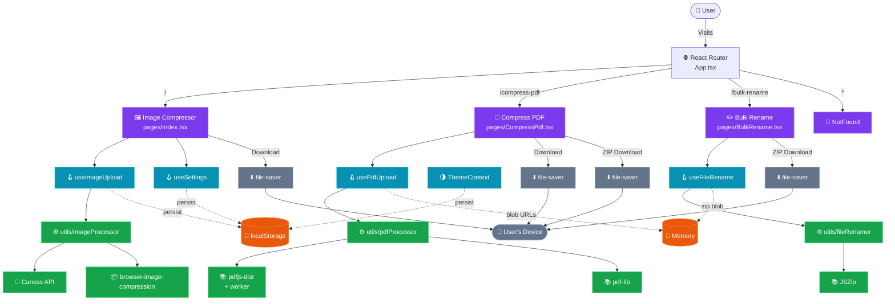
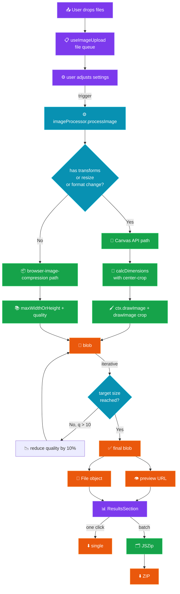
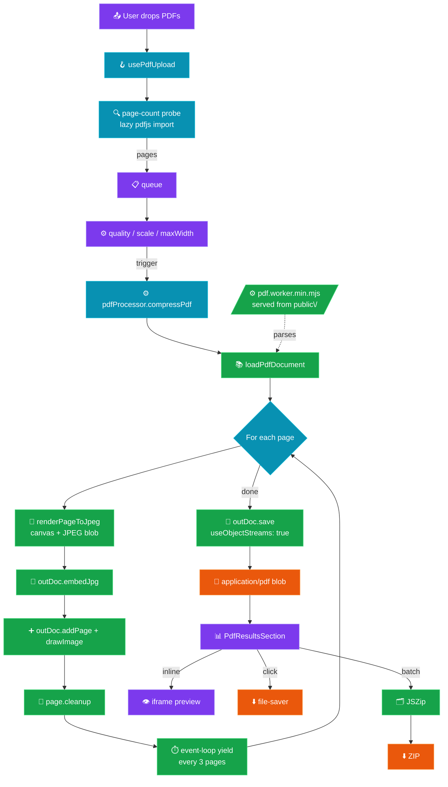
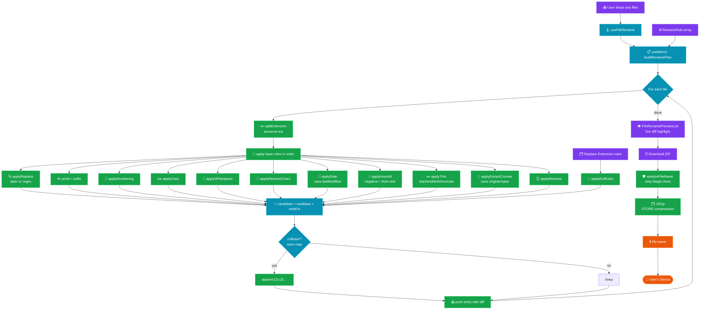
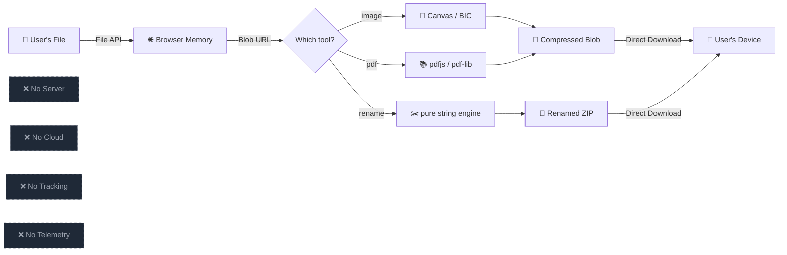

# ⚡ ImageSqueeze — Free Browser-Native File Toolkit

> **Compress images up to 90%, compress PDFs, and rename hundreds of files in bulk — all 100% in your browser. No uploads, no accounts, no tracking.**

[](https://react.dev)
[](https://typescriptlang.org)
[](https://tailwindcss.com)
[](https://vitejs.dev)
[](#-testing)
[](https://choosealicense.com/licenses/mit/)
[](#)
[](#-system-architecture)
[](http://makeapullrequest.com)

---

## 📑 Table of Contents

- [🎯 What is ImageSqueeze?](#-what-is-imagesqueeze)
- [🧰 Three Powerful Tools, One App](#-three-powerful-tools-one-app)
- [✨ Key Highlights](#-key-highlights)
- [🚀 Features](#-features)
  - [🖼️ Image Compressor (`/`)](#️-image-compressor-)
  - [📕 Compress PDF (`/compress-pdf`)](#-compress-pdf-compress-pdf)
  - [✏️ Bulk File Rename (`/bulk-rename`)](#️-bulk-file-rename-bulk-rename)
  - [🛡️ Cross-Cutting Concerns](#️-cross-cutting-concerns)
- [🏗️ System Architecture](#️-system-architecture)
  - [🗺️ App-Wide Architecture](#️-app-wide-architecture)
  - [🖼️ Image Compression Pipeline](#️-image-compression-pipeline)
  - [📕 PDF Compression Pipeline](#-pdf-compression-pipeline)
  - [✏️ Bulk Rename Pipeline](#️-bulk-rename-pipeline)
  - [🛡️ Privacy Architecture](#️-privacy-architecture)
- [🛠️ Tech Stack](#️-tech-stack)
- [📊 Performance Stats](#-performance-stats)
- [🚀 Getting Started](#-getting-started)
- [⚙️ Configuration](#️-configuration)
- [📁 Project Structure](#-project-structure)
- [🧪 Testing](#-testing)
- [♿ Accessibility](#-accessibility)
- [🔒 Privacy & Security](#-privacy--security)
- [🌐 SEO Optimization](#-seo-optimization)
- [📄 License](#-license)
- [🙏 Credits & Thanks](#-credits--thanks)

---

## 🎯 What is ImageSqueeze?

**ImageSqueeze** is a **100% client-side** file toolkit for the three most common browser tasks that normally force you to upload your files to a stranger's server:

1. **🖼️ Compress images** — resize, recompress, and convert format (with social-media presets)
2. **📕 Compress PDFs** — shrink PDFs by re-rendering every page as a JPEG
3. **✏️ Bulk rename files** — find & replace, number, change case, sanitize — for *any* file type

> 🎯 **Mission**: Provide a fast, private, and free alternative to bloated online tools that require uploads, accounts, or watermarks.

> 🔐 **Privacy by default**: every byte stays in your browser. Closing the tab is the only "delete" you need.

---

## 🧰 Three Powerful Tools, One App

| Tool | Route | Best For | Max Inputs | Engine |
|------|-------|----------|------------|--------|
| 🖼️ **Image Compressor** | [`/`](#) | Photos, social media, web assets | **10** images × 25 MB | Canvas API + `browser-image-compression` |
| 📕 **Compress PDF** | [`/compress-pdf`](#) | Image-heavy PDFs, email attachments | **5** PDFs × 100 MB | `pdfjs-dist` + `pdf-lib` |
| ✏️ **Bulk File Rename** | [`/bulk-rename`](#) | Any file type, batch renaming | **100** files × 200 MB | Pure JS string engine + `jszip` |

All three tools share:

- 🌗 Dark / light mode (persisted)
- 🎨 Identical design system, shadcn/ui primitives, Tailwind tokens
- ⌨️ Full keyboard navigation + screen-reader support
- 📋 Paste-from-clipboard and page-level drag-and-drop
- 💾 Zero network requests at runtime

---

## ✨ Key Highlights

- 🔒 **100% Private** — every byte stays in the browser, no API calls, no telemetry
- ⚡ **Instant Processing** — no upload delays, no server round-trips
- 🆓 **Free Forever** — no subscriptions, no hidden fees, no watermarks
- 📱 **Fully Responsive** — works on desktop, tablet, and mobile
- 🌙 **Dark/Light Mode** — theme persists across sessions via `localStorage`
- 🎯 **Smart Presets** — one-click social media presets + compression level buttons
- 🧠 **Smart Targeting** — specify target KB and the engine finds the right quality
- 📦 **Batch + ZIP** — process many files and download as a single ZIP
- 👁️ **Live Preview** — see renamed file diffs *before* downloading
- ♿ **Accessible** — WCAG AA compliant with full keyboard & screen-reader support

---

## 🚀 Features

### 🖼️ Image Compressor (`/`)

> The flagship tool. Resize, recompress, and convert up to 10 images at once with full social-media preset support.

#### 🗜️ Compression

- **🎚️ Quality Slider** — Adjustable from **10–100%** with real-time quality indicator
  - 🟢 **High (80–100%)** — minimal compression, best quality
  - 🟡 **Balanced (50–79%)** — great for web & social media
  - 🔴 **Aggressive (10–49%)** — maximum compression for thumbnails
- **⚡ Auto Optimize for Web** — locks quality at **75%** for the best balance
- **🎯 Target File Size** — specify max KB and the engine auto-discovers the right quality (iterates down by 10% until under target)
- **🔁 Multi-Engine Pipeline** — `browser-image-compression` with **Canvas API fallback** for reliability
- **📉 Live Stats** — real-time before/after size, reduction %, savings in KB

#### 📐 Resize

- **🧮 Custom Dimensions** — width/height inputs with pixel precision
- **🔗 Aspect Ratio Lock** — auto-recalculates the missing dimension
- **🎯 9 Social Media Presets** — one-click apply with **center-crop to fit** (no distortion)

| Platform | Preset | Dimensions |
|----------|--------|------------|
| 📸 | Instagram Post | 1080×1080 |
| 📱 | Instagram Story | 1080×1920 |
| 💼 | LinkedIn Post | 1200×627 |
| 💼 | LinkedIn Banner | 1584×396 |
| 💬 | WhatsApp DP | 500×500 |
| 🐦 | Twitter / X Post | 1200×675 |
| 📘 | Facebook Cover | 820×312 |
| 📺 | YouTube Thumbnail | 1280×720 |
| 🖥️ | Full HD | 1920×1080 |

> 💡 **Pro Tip**: The optimizer center-crops to the preset's aspect ratio — upload any photo and you'll get a platform-perfect result.

#### 🔄 Format Conversion

| Format | Best For | Notes |
|--------|----------|-------|
| **JPEG** | Photos, complex images | Universal compatibility |
| **PNG** | Transparency, graphics | Lossless, larger files |
| **WebP** ⭐ | Web performance | ~30% smaller than JPEG at same quality |
| **Keep Original** | Compression only | No format change |

#### 🔄 Other Transforms

- 🔁 **Rotation** — 0°, 90°, 180°, 270°
- 🪞 **Mirror / Flip** — horizontal flip
- ⚫ **Grayscale** — convert to black & white
- 🛡️ **Strip EXIF** — remove camera info, GPS, and other metadata (privacy)

#### 📦 Batch Processing

- **📤 Batch Upload** — up to **10 images** simultaneously
- **🖱️ Drag & Drop** — or click to browse
- **⌨️ Paste from Clipboard** — `Ctrl+V` works anywhere
- **📊 Progress Tracking** — real-time progress bar with status badges
- **⬇️ Individual Download** — download single processed images
- **🗂️ Batch ZIP Download** — download all as a single ZIP via **JSZip**
- **🆚 Before/After Cards** — visual comparison with size reduction stats

---

### 📕 Compress PDF (`/compress-pdf`)

> Re-renders every page as a JPEG and rebuilds the document — the most reliable way to shrink image-heavy PDFs in the browser.

#### 🎚️ Three Compression Levels

| Level | JPEG Quality | Max Width | Best For |
|-------|--------------|-----------|----------|
| 🚀 **Strong** | 40% | 1100 px | Emailing, sharing — smallest file |
| ⚡ **Balanced** ⭐ | 60% | 1700 px | Recommended default |
| ✨ **Light** | 82% | 2400 px | Best quality, still smaller |

- **🎚️ Custom Slider** — fine-tune JPEG quality from 10% to 95% (auto-switches to "Custom" preset)
- **📄 Per-Page Progress** — live "page N/M" status with a smooth progress bar
- **🧠 Memory-Conscious** — eager `page.cleanup()` + event-loop yields every 3 pages keep RAM bounded on large PDFs
- **📥 Drag & Drop** or browse — accepts up to 5 PDFs (100 MB each)
- **👁️ In-App Preview** — view the compressed PDF inline before downloading
- **🗂️ Batch ZIP** — multi-file download wrapped in a ZIP

> ⚠️ **Trade-off note**: pages become image-only PDFs, so text is no longer selectable. Document *appearance* is preserved; the search/copy-text workflow is not.

#### ⚙️ Engine Details

- **Parser**: `pdfjs-dist` v6 (lazy-loaded with a code-split chunk — never fetched unless the user visits this page)
- **Builder**: `pdf-lib` v1.17
- **Worker**: pdfjs 1.2 MB minified worker is served as a static file from `public/pdf.worker.min.mjs`
- **Output**: `image/jpeg` per page, embedded via `outDoc.embedJpg()`, with `useObjectStreams: true` for smaller files

---

### ✏️ Bulk File Rename (`/bulk-rename`)

> Pure string-manipulation engine with a live preview. Works for **any** file type — images, docs, archives, source code, anything.

#### 🎛️ Thirteen Rule Types (stackable, reorderable)

| Rule | What it does | Options |
|------|--------------|---------|
| 🔍 **Find & Replace** | Replace text or regex | Plain / Regex, Case-sensitive toggle |
| ✏️ **Add Prefix** | Prepend text | — |
| ✏️ **Add Suffix** | Append text (before extension) | — |
| 🔢 **Numbering** | Sequential numbers | Position (start/end), separator, start, zero-pad width |
| Aa **Change Case** | Transform case | `lower` / `UPPER` / `Title Case` / `Sentence case` |
| 📏 **Whitespace** | Replace or strip spaces | `a-b` / `a_b` / `ab` (remove) |
| 🧹 **Remove Chars** | Strip specific characters | Any character set |
| 📅 **Date Stamp** | Insert the file's `lastModified` as prefix/suffix | 7 formats (`YYYY-MM-DD`, `YYYYMMDD`, `YYYY-MM-DD_HHMMSS`, `YYYY-MM-DD HHMM`, `DD-MM-YYYY`, `MM-DD-YYYY`, `ISO`), separator, "use now" override |
| 🧷 **Insert At** | Inject text at a character index | Index (negative = from end), text |
| ✂️ **Trim / Truncate** | Strip ends or cap to a max length | Mode: `start` / `end` / `both` / `truncate`; char count or max length; optional `…` |
| 🗂️ **Replace Extension** | Set, lowercase, uppercase, or strip the extension | Mode: `set` (with optional leading dot) / `lower` / `upper` / `remove` |
| 🔁 **Counter From Name** | Re-sequence the existing number in the filename | Where (`first`/`last`), place at (`start`/`end`), separator, pad, fallback start |
| 🪞 **Reverse Name** | Flip the base name backwards | — |

#### 👁️ Live Preview

- **Before / After diff** — the original name is struck through, the new name is shown with a highlighted changed segment
- **Per-file badges** — `N renamed`, `No changes yet`
- **Drag-to-reorder** rules (up/down arrows on each rule)
- **🛡️ Built-in safety**:
  - Extensions are **always preserved** untouched
  - **Name sanitisation** strips illegal characters (`<>:"/\|?*` and control chars) so the result opens on every OS
  - **De-duplication** — if two files end up with the same name, `(2)`, `(3)`, … are appended to keep every entry unique in the ZIP

#### 📤 Download

- One click → ZIP of all renamed files in a `renamed/` folder
- Up to **100 files × 200 MB** per session
- Progress bar with live percentage during ZIP build

#### 💡 Common Recipes

| Recipe | Rules to stack |
|--------|----------------|
| **Screenshots to share** | Find&Replace `Screenshot ` → ``, Case `lower`, Whitespace `dash` |
| **Numbered batch** | Numbering `start=1 pad=2 separator=_ position=start` |
| **Date-stamped** | Date `format=YYYY-MM-DD position=start separator=_` |
| **URL-safe slugs** | Whitespace `dash`, Remove Chars `!@#$%^&*()`, Case `lower` |
| **Re-sequence broken numbering** | Counter From Name `where=last fallbackStart=1 pad=2 position=end` |
| **Normalise extensions to lowercase** | Replace Extension `mode=lower` |
| **Cap long names to 40 chars** | Trim `mode=truncate maxLength=40 ellipsis=true` |

---

### 🛡️ Cross-Cutting Concerns

#### Error Handling (every tool)

- **⚠️ Large file warnings** — toast before processing files that exceed recommended sizes
- **🎞️ Animated-GIF notice** — warns the user that GIFs will become static
- **🚧 Per-file errors** — failed files show their own error message, batch processing continues
- **🔄 Graceful fallbacks** — Canvas API is used when the primary engine can't handle a format
- **🧹 Memory cleanup** — object URLs are revoked on unmount; PDF pages are eagerly released

#### UX Consistency

- **Identical upload zone** component, themed for each tool
- **Identical queue** component (file list, progress bars, status badges, retry, remove)
- **Identical "how it works" + FAQ + features** sections at the bottom of each page
- **Identical header / footer / theme toggle** across all three routes

---

## 🏗️ System Architecture

ImageSqueeze follows a **fully client-side, layered, multi-route architecture**. Every layer runs in the browser — there is **no backend service** and no telemetry endpoint.

### 🗺️ App-Wide Architecture



### 🖼️ Image Compression Pipeline



### 📕 PDF Compression Pipeline



### ✏️ Bulk Rename Pipeline



### 🛡️ Privacy Architecture



> 🔐 **Zero data ever leaves the user's device.** No API calls, no telemetry, no third-party requests at runtime. The only network traffic is loading the static HTML / JS / CSS / pdf-worker bundle.

---

## 🛠️ Tech Stack

### 🖥️ Frontend (Core)

| Technology | Version | Purpose |
|------------|---------|---------|
| **React** | 18.3.1 | UI framework & state management |
| **TypeScript** | 5.8.x | Type safety & developer experience |
| **Vite** | 5.4.x | Lightning-fast HMR & bundling |
| **Tailwind CSS** | 3.4.x | Utility-first responsive styling |
| **shadcn/ui** | Latest | Accessible component library |
| **React Router** | 6.30.x | SPA navigation & routing |
| **Framer Motion** | 12.x | UI animations & transitions |

### 📚 Feature Libraries

| Package | Used by | Purpose |
|---------|---------|---------|
| `browser-image-compression` | Image | Client-side image compression engine |
| `pdfjs-dist` | PDF | PDF parsing & page rendering |
| `pdf-lib` | PDF | PDF document construction |
| `jszip` | Image, PDF, Rename | ZIP file generation |
| `file-saver` | All | Cross-browser file save triggers |
| `lucide-react` | All | Tree-shakable icon set |
| `sonner` | All | Toast notifications |
| `next-themes` | All | Theme management |
| `zod` | All | Runtime schema validation |
| `react-hook-form` | All | Performant form state |
| `@tanstack/react-query` | All | Async data caching |
| `@radix-ui/*` | All | Accessible UI primitives |

### 🧰 Development Tools

| Tool | Version | Purpose |
|------|---------|---------|
| **ESLint** | 9.x | Code linting & quality enforcement |
| **TypeScript ESLint** | 8.x | Type-aware linting rules |
| **Vitest** | 3.x | Unit & integration testing |
| **Testing Library** | 16.x | React component testing |
| **jsdom** | 20.x | Browser environment for tests |
| **PostCSS** | 8.x | CSS processing pipeline |
| **Autoprefixer** | 10.x | Vendor prefix automation |
| **Lovable Tagger** | Latest | Dev-mode component tagging |
| **SWC** | — | Rust-based JS/TS compiler (via Vite plugin) |

---

## 📊 Performance Stats

### 🖼️ Image Compressor

| Metric | Value |
|--------|-------|
| 🗜️ **Compression Ratio** | Up to **90%** file size reduction |
| 📦 **Max Batch Size** | **10 images** per session |
| 📥 **Supported Input** | JPG, PNG, WebP, AVIF, GIF, BMP |
| 📤 **Output Formats** | JPEG, PNG, WebP, Original |
| 📐 **Max Resolution** | Browser memory limited |
| ☁️ **Server Uploads** | **Zero** — fully client-side |
| 🎯 **Default Quality** | 75% (Auto-Optimize mode) |

### 📕 Compress PDF

| Metric | Value |
|--------|-------|
| 🗜️ **Typical Reduction** | 50–85% for image-heavy PDFs |
| 📦 **Max Batch Size** | **5 PDFs** per session |
| 📄 **Per-File Limit** | 100 MB |
| 🎚️ **Quality Range** | 10–95% JPEG |
| 📐 **Max Render Width** | 2400 px (Light) / 1100 px (Strong) |
| 🧠 **Memory Strategy** | Eager `page.cleanup()` + yields every 3 pages |
| ⚡ **Code-Split** | pdfjs (~470 KB) loads only on this page |

### ✏️ Bulk Rename

| Metric | Value |
|--------|-------|
| 📦 **Max Files** | **100 files** per session |
| 📥 **Per-File Limit** | 200 MB |
| 🎛️ **Rule Types** | **7** (replace, prefix, suffix, numbering, case, whitespace, remove) |
| 🔀 **Stackable** | Yes — rules apply in order |
| 📐 **Rule Reordering** | Up/Down arrows on each rule |
| 👁️ **Live Preview** | Diff-highlighted per file |
| 🛡️ **Safety** | Extensions preserved, illegal chars stripped, names de-duplicated |
| 📤 **Output** | ZIP of `renamed/` folder |

### 🌍 Global

| Metric | Value |
|--------|-------|
| 🧠 **Memory Management** | Object URLs auto-revoked on unmount |
| ⚡ **Lazy Loading** | Code-split by route & component (per-route chunks < 470 KB) |
| 🧪 **Test Coverage** | 106 unit tests across 3 modules |
| 🚀 **Dev Server** | Port `8080` (HMR enabled) |

---

## 🚀 Getting Started

### ✅ Prerequisites

Before you begin, make sure you have the following installed:

- **Node.js** ≥ 18.x — [Install via nvm](https://github.com/nvm-sh/nvm#installing-and-updating)
- **npm** (bundled with Node.js) **or** **bun** package manager
- **Git** — for cloning the repository

### 📥 Installation

```bash
# 1️⃣ Clone the repository
git clone https://github.com/girishlade111/image-squeeze-express.git

# 2️⃣ Navigate to the project directory
cd image-squeeze-express

# 3️⃣ Install dependencies
npm install
# or (faster)
bun install
```

### ▶️ Run Development Server

```bash
npm run dev
# or
bun dev
```

> 🌐 **App URL**: `http://localhost:8080`
> ⚡ **HMR**: Enabled — changes hot-reload instantly without page refresh
> 🗺️ **Available routes**: `/`, `/compress-pdf`, `/bulk-rename`, `/about`, `/privacy`, `/terms`, `/contact`

### 🏗️ Build for Production

```bash
# Create optimized production build
npm run build

# Output directory: dist/
# Notable assets: pdf.worker.min.mjs (1.2 MB, served as static file)
```

### 👀 Preview Production Build

```bash
npm run preview
```

### 🧪 Run Tests

```bash
# Run tests once
npm run test

# Watch mode (re-runs on file change)
npm run test:watch
```

### 🧹 Lint Code

```bash
npm run lint
```

### 📜 Available Scripts

| Script | Description |
|--------|-------------|
| `npm run dev` | Start Vite dev server with HMR on port `8080` |
| `npm run build` | Build production bundle to `dist/` |
| `npm run build:dev` | Build in development mode (unminified) |
| `npm run preview` | Preview the production build locally |
| `npm run lint` | Run ESLint on the entire project |
| `npm run test` | Run Vitest test suite once |
| `npm run test:watch` | Run Vitest in watch mode |

---

## ⚙️ Configuration

### 🎨 Theme Colors

Customize theme tokens in `src/index.css`:

```css
:root {
  /* 🟣 Primary: Violet */
  --primary: 263 70% 58%;

  /* 🩵 Accent: Cyan */
  --accent: 187 92% 43%;

  /* ☀️ Light mode background */
  --background: 210 20% 98%;
  --foreground: 240 10% 10%;

  /* 🟢 Success green */
  --success: 142 71% 45%;
}

.dark {
  /* 🌙 Dark mode background */
  --background: 0 0% 5.9%;
  --foreground: 0 0% 95%;
}
```

### 🌀 Tailwind Extensions

Custom animations & utilities in `tailwind.config.ts`:

```typescript
// Custom animations
animations: {
  fadeIn,        // Smooth opacity transition
  fadeInUp,      // Rise + fade entrance
  scaleIn,       // Scale-up entrance
  slideInRight,  // Horizontal slide
  float,         // Gentle floating motion
  shimmer,       // Loading skeleton effect
}

// Custom utilities
utilities: {
  glass-card,        // Frosted glass card
  gradient-text,     // Gradient text fill
  gradient-bg,       // Gradient background
  gradient-border,   // Gradient border
  glass-morphism,    // Glassmorphism effect
}
```

### 💾 Settings Storage

User settings persisted to `localStorage`:

| Key | Setting | Default | Type |
|-----|---------|---------|------|
| `imagesqueeze-settings` | Image preferences | See below | JSON |
| `imagesqueeze-theme` | Dark/Light mode | `dark` | string |

### 🎛️ Default Image Settings

| Setting | Default | Range / Options |
|---------|--------|-----------------|
| Quality | `75` | 10–100 |
| Auto Optimize | `true` | boolean |
| Output Format | `webp` | jpeg / png / webp / original |
| Lock Aspect Ratio | `true` | boolean |
| Target Size (KB) | `null` | number / null |
| Width | `null` | number / null |
| Height | `null` | number / null |
| Strip EXIF | `true` | boolean |
| Grayscale | `false` | boolean |
| Rotation | `0` | 0 / 90 / 180 / 270 |
| Mirror | `false` | boolean |
| Progressive JPEG | `true` | boolean |

### 📕 PDF Compressor Defaults

| Setting | Default |
|---------|---------|
| Preset | `medium` (60% quality, 1700 px max width, 1.75× scale) |
| Output | `image/jpeg` per page, rebuilt with `pdf-lib` |
| Worker URL | `/pdf.worker.min.mjs` (static asset) |

### ✏️ Bulk Rename Defaults

| Setting | Default |
|---------|---------|
| Rules | `[]` (empty — user adds as needed) |
| Output | ZIP of `renamed/` folder via `jszip` (STORE compression) |
| Max files | `100` |
| Max file size | `200 MB` |

### 🌙 Dark Mode

- **Default Theme**: Dark mode
- **Persistence Key**: `imagesqueeze-theme`
- **No Flash on Reload**: Inline script in `index.html` applies theme before React hydrates
- **System Preference**: Detects `prefers-color-scheme` on first visit

### ⚙️ Vite Config Highlights

Defined in `vite.config.ts`:

| Option | Value | Notes |
|--------|-------|-------|
| `server.host` | `"::"` | Listens on all IPv6/IPv4 interfaces |
| `server.port` | `8080` | Dev server port |
| `server.hmr.overlay` | `false` | Disables error overlay |
| `resolve.alias` | `"@" → ./src` | Path alias for clean imports |
| `plugins` | `react-swc` | Fast Rust-based React compiler |

---

## 📁 Project Structure

```
image-squeeze-express/
├── public/
│   └── pdf.worker.min.mjs   # pdfjs worker (1.2 MB, served statically)
├── src/
│   ├── components/
│   │   ├── Header.tsx                # Fixed nav, theme toggle, route links
│   │   ├── HeroSection.tsx           # Image tool hero
│   │   ├── UploadZone.tsx            # Image upload zone
│   │   ├── ImageQueue.tsx            # Image file queue
│   │   ├── SettingsPanel.tsx         # Image settings (Compress/Resize/Format/More)
│   │   ├── ResultsSection.tsx        # Image before/after cards
│   │   ├── SocialPresetsGrid.tsx     # One-click social media presets
│   │   ├── PdfUploadZone.tsx         # PDF upload zone
│   │   ├── PdfQueue.tsx              # PDF file queue with per-file progress
│   │   ├── PdfSettingsPanel.tsx      # PDF compression level + slider
│   │   ├── PdfResultsSection.tsx     # PDF results with inline preview
│   │   ├── FileRenameUploadZone.tsx  # Rename upload zone (any file)
│   │   ├── FileRenameRuleBuilder.tsx # Reorderable rule stack
│   │   ├── FileRenamePreviewList.tsx # Live before/after diff list
│   │   ├── HowItWorks.tsx            # Image tool — 3-step explainer
│   │   ├── FeaturesGrid.tsx          # Image tool — feature cards
│   │   ├── FAQSection.tsx            # Image tool — accordion FAQ
│   │   ├── ProTeaser.tsx             # Pro upsell
│   │   ├── Footer.tsx                # Shared links & attribution
│   │   ├── PageDropOverlay.tsx       # Page-level drag overlay
│   │   ├── LazySection.tsx           # Intersection-observer wrapper
│   │   ├── NavLink.tsx               # Nav link primitive
│   │   └── ui/                       # shadcn/ui primitives
│   ├── hooks/
│   │   ├── useImageUpload.ts         # Image queue + processing
│   │   ├── usePdfUpload.ts           # PDF queue + processing
│   │   ├── useFileRename.ts          # Rename queue + rules + ZIP
│   │   ├── useSettings.ts            # Settings with localStorage persistence
│   │   ├── useClipboardPaste.ts      # Global Ctrl+V handler
│   │   ├── usePageDropZone.ts        # Page-level drag-and-drop
│   │   └── use-mobile.tsx            # Mobile breakpoint detection
│   ├── contexts/
│   │   └── ThemeContext.tsx          # Dark/light mode provider
│   ├── utils/
│   │   ├── imageProcessor.ts         # Image engine (Canvas + BIC)
│   │   ├── pdfProcessor.ts           # PDF engine (pdfjs + pdf-lib)
│   │   └── fileRenamer.ts            # Rename engine (pure JS string ops)
│   ├── pages/
│   │   ├── Index.tsx                 # 🖼️ Image tool (`/`)
│   │   ├── CompressPdf.tsx           # 📕 PDF tool (`/compress-pdf`)
│   │   ├── BulkRename.tsx            # ✏️ Rename tool (`/bulk-rename`)
│   │   ├── About.tsx
│   │   ├── Contact.tsx
│   │   ├── PrivacyPolicy.tsx
│   │   ├── TermsOfService.tsx
│   │   └── NotFound.tsx
│   ├── test/
│   │   ├── setup.ts
│   │   ├── example.test.ts
│   │   ├── imageProcessor.test.ts    # 27 tests
│   │   ├── pdfProcessor.test.ts      # 12 tests
│   │   └── fileRenamer.test.ts       # 66 tests
│   ├── App.tsx                       # Router
│   ├── main.tsx                      # Entry point
│   └── index.css                     # Styles & design tokens
├── components.json                   # shadcn/ui configuration
├── tailwind.config.ts                # Tailwind theme & extensions
├── vite.config.ts                    # Vite configuration
├── vitest.config.ts                  # Vitest test configuration
├── postcss.config.js                 # PostCSS plugins
├── eslint.config.js                  # ESLint flat config
├── tsconfig.json                     # TypeScript root config
├── tsconfig.app.json                 # App-specific TS config
├── tsconfig.node.json                # Node-side TS config
├── index.html                        # HTML entry
├── package.json                      # Dependencies & scripts
└── README.md                         # You are here 👋
```

---

## 🧪 Testing

The project ships with **106 unit tests** across 3 modules, all in pure-function form so they run in jsdom without any browser shim.

### 📋 Test Coverage

| Module | Tests | What it covers |
|--------|-------|----------------|
| `imageProcessor.test.ts` | 27 | `formatFileSize`, `getCompressionRatio`, `estimateQualityForSize`, `computeAspectDimensions`, **`calcDimensions` (with center-crop logic)** |
| `pdfProcessor.test.ts` | 12 | `formatBytes`, `getReductionRatio`, `getQualityPresetSettings`, preset bounds |
| `fileRenamer.test.ts` | 39 | `splitExtension`, all 7 rule types, rule ordering, dedup with collisions, `sanitizeFileName` |

### ▶️ Running Tests

```bash
# Run once
npm run test

# Watch mode
npm run test:watch
```

### 🎯 What the Tests Catch

- ✅ **Social-media preset bug regression** — the original `calcDimensions` overrode explicit dimensions with source aspect; tests now cover the fix
- ✅ **PDF preset invariants** — quality stays in `[0.1, 1.0]`, scale is positive, `low` < `high` in both quality and max width
- ✅ **Rename edge cases** — empty finds/replaces, invalid regex, leading-dot hidden files, trailing dots, dedup when renamed names collide
- ✅ **Filename safety** — Windows/macOS illegal characters, control chars, length cap, fallback when everything is stripped

---

## ♿ Accessibility

- ✅ **WCAG AA** color contrast compliance
- ✅ `aria-label` on all icon-only buttons
- ✅ `role="button"` with full keyboard support
- ✅ `aria-pressed` / `aria-checked` on toggles
- ✅ `aria-expanded` / `aria-controls` on the mobile nav
- ✅ Semantic HTML (`nav`, `section`, `header`, `footer`, `main`)
- ✅ `focus-visible` ring styles for keyboard navigation
- ✅ Proper `alt` text on all images
- ✅ `aria-live="polite"` on progress regions

---

## 🔒 Privacy & Security

- ✅ **Zero server uploads** — all processing happens in-browser
- ✅ **No tracking** — no cookies, no analytics, no fingerprinting
- ✅ **No account required** — fully anonymous usage
- ✅ **Memory cleanup** — object URLs revoked on unmount to prevent leaks
- ✅ **No third-party requests at runtime**
- ✅ **PDF worker bundled as static asset** — no third-party CDN
- ✅ **Open source** — audit the code yourself

---

## 🌐 SEO Optimization

- ✅ Single `<h1>` per page with primary keyword
- ✅ Meta description <160 characters
- ✅ Open Graph & Twitter Cards
- ✅ JSON-LD structured data
- ✅ Canonical URL configured
- ✅ Semantic HTML throughout
- ✅ Lazy-loaded images and routes
- ✅ Per-route code splitting (home / pdf / rename)

---

## 📄 License

**MIT License** — Built with ❤️ by [Lade Stack](https://ladestack.in)

```
MIT License

Copyright (c) 2026 Girish Lade

Permission is hereby granted, free of charge, to any person obtaining a copy
of this software and associated documentation files (the "Software"), to deal
in the Software without restriction, including without limitation the rights
to use, copy, modify, merge, publish, distribute, sublicense, and/or sell
copies of the Software...
```

---

## 🙏 Credits & Thanks

### 🖼️ Image tool
- [React](https://react.dev) — UI framework
- [Vite](https://vitejs.dev) — Build tool
- [Tailwind CSS](https://tailwindcss.com) — Styling
- [shadcn/ui](https://ui.shadcn.com) — Component library
- [browser-image-compression](https://github.com/Donaldcwl/browser-image-compression) — Compression engine
- [JSZip](https://stuk.github.io/jszip/) — ZIP generation
- [file-saver](https://github.com/eligrey/FileSaver.js) — File saving
- [Lucide](https://lucide.dev) — Icon set
- [Sonner](https://sonner.emilkowal.dev) — Toast notifications
- [Framer Motion](https://www.framer.com/motion/) — Animations

### 📕 PDF tool
- [pdf.js](https://mozilla.github.io/pdf.js/) — PDF parsing
- [pdf-lib](https://pdf-lib.js.org) — PDF construction

### ✏️ Rename tool
- [JSZip](https://stuk.github.io/jszip/) — ZIP generation (shared)
- [file-saver](https://github.com/eligrey/FileSaver.js) — File saving (shared)

### 🌐 Platform
- [Lovable](https://lovable.dev) — Development platform

---

## 📈 Live Stats

```
┌─────────────────────────────────────┐
│  Images Processed   │     0         │
│  PDFs Compressed    │     0         │
│  Files Renamed      │     0         │
│  Total Reduced      │     0 KB      │
│  Avg Reduction      │     0%        │
└─────────────────────────────────────┘
        ↑ Updates when you use any tool ↑
```

---

<div align="center">

**Last Updated**: June 2026
**Version**: 2.0.0
**Maintainer**: [@girishlade111](https://github.com/girishlade111)

⭐ **Star this repo** if ImageSqueeze saved you time or bandwidth!

</div>
