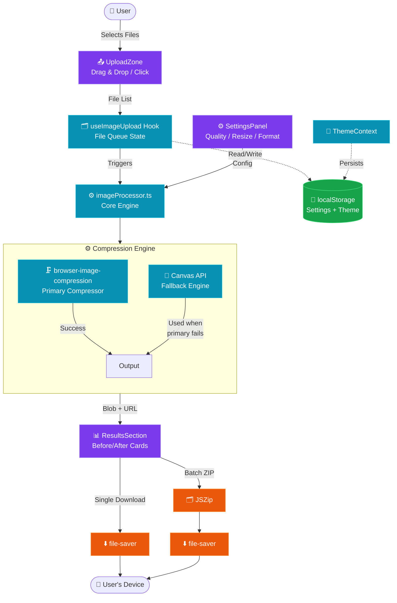
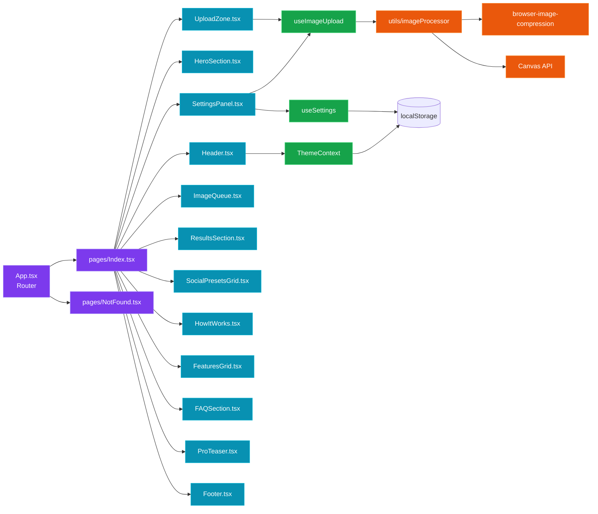
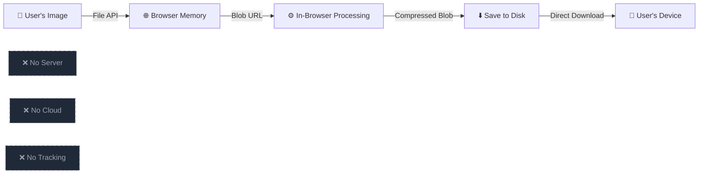

# ⚡ ImageSqueeze — Free Image Compressor, Resizer & WebP Converter

> **Compress images up to 90% online for free.** Resize for Instagram, LinkedIn, YouTube & more. Convert to WebP. 100% private — your images **never** leave your browser.

[](https://react.dev)
[](https://typescriptlang.org)
[](https://tailwindcss.com)
[](https://vitejs.dev)
[](https://choosealicense.com/licenses/mit/)
[](#)
[](#-system-architecture)
[](http://makeapullrequest.com)

---

## 📑 Table of Contents

- [📸 What is ImageSqueeze?](#-what-is-imagesqueeze)
- [✨ Key Highlights](#-key-highlights)
- [🚀 Features](#-features)
  - [🗜️ Compression](#️-compression)
  - [📐 Resize](#-resize)
  - [🔄 Format Conversion](#-format-conversion)
  - [📦 Batch Processing](#-batch-processing)
  - [🛡️ Error Handling](#️-error-handling)
- [🏗️ System Architecture](#️-system-architecture)
- [🛠️ Tech Stack](#️-tech-stack)
- [📊 Performance Stats](#-performance-stats)
- [🚀 Getting Started](#-getting-started)
- [⚙️ Configuration](#️-configuration)
- [📁 Project Structure](#-project-structure)
- [♿ Accessibility](#-accessibility)
- [🔒 Privacy & Security](#-privacy--security)
- [🌐 SEO Optimization](#-seo-optimization)
- [📄 License](#-license)
- [🙏 Credits & Thanks](#-credits--thanks)

---

## 📸 What is ImageSqueeze?

**ImageSqueeze** is a **100% client-side** image compression, resizing, and format conversion tool. No server uploads, no accounts, no tracking — everything runs **instantly in your browser** using modern web APIs like the **Canvas API** and **Web Workers**.

> 🎯 **Mission**: Provide a fast, private, and free alternative to bloated online image compressors that require uploads, accounts, or watermarks.

---

## ✨ Key Highlights

| Feature | Description |
|---------|-------------|
| 🔒 **100% Private** | Images processed in-browser using Canvas API & Web Workers — never leave your device |
| ⚡ **Instant Processing** | No upload delays, no server round-trips — compression starts immediately |
| 🆓 **Free Forever** | No subscriptions, no hidden fees, no watermarks — ever |
| 📱 **Fully Responsive** | Works beautifully on desktop, tablet, and mobile devices |
| 🌙 **Dark/Light Mode** | Theme persists across sessions via `localStorage` |
| 🎯 **Smart Presets** | One-click resize for all major social media platforms |
| 🧠 **Smart Targeting** | Specify target KB — engine finds the perfect quality automatically |
| 📦 **Batch + ZIP** | Compress up to 10 images and download them all as a single ZIP |
| ♿ **Accessible** | WCAG AA compliant with full keyboard navigation & screen reader support |

---

## 🚀 Features

### 🗜️ Compression

- **🎚️ Quality Slider** — Adjustable from **10–100%** with real-time quality indicator:
  - 🟢 **High (80–100%)** — Minimal compression, best quality
  - 🟡 **Balanced (50–79%)** — Great for web & social media
  - 🔴 **Aggressive (10–49%)** — Maximum compression for thumbnails
- **⚡ Auto Optimize for Web** — Locks quality at **75%** for optimal balance
- **🎯 Target File Size** — Specify max KB; engine auto-discovers the right quality
- **🔁 Multi-Engine Pipeline** — Uses `browser-image-compression` with **Canvas API fallback** for reliability
- **📉 Live Stats** — Real-time before/after size, reduction %, and savings in KB

### 📐 Resize

- **🧮 Custom Dimensions** — Width/height inputs with pixel precision
- **🔗 Aspect Ratio Lock** — Automatically recalculates the missing dimension
- **🎯 9 Social Media Presets** — One-click apply:

| Platform | Preset | Dimensions |
|----------|--------|------------|
| 📸 | Instagram Post | 1080×1080 |
| 📱 | Instagram Story | 1080×1920 |
| 💼 | LinkedIn Post | 1200×627 |
| 💼 | LinkedIn Banner | 1584×396 |
| 💬 | WhatsApp DP | 500×500 |
| 🐦 | Twitter/X Post | 1200×675 |
| 📘 | Facebook Cover | 820×312 |
| 📺 | YouTube Thumbnail | 1280×720 |
| 🖥️ | Full HD | 1920×1080 |

### 🔄 Format Conversion

| Format | Best For | Notes |
|--------|----------|-------|
| **JPEG** | Photos, complex images | Universal compatibility |
| **PNG** | Transparency, graphics | Lossless, larger files |
| **WebP** ⭐ | Web performance | ~30% smaller than JPEG at same quality |
| **Keep Original** | Compression only | No format change |

> 💡 **Pro Tip**: WebP is recommended — same quality, **30% smaller** file size, better Core Web Vitals.

### 📦 Batch Processing

- **📤 Batch Upload** — Up to **10 images** simultaneously
- **🖱️ Drag & Drop** — Or click to browse files
- **📊 Progress Tracking** — Real-time progress bar with status badges
- **⬇️ Individual Download** — Download single processed images
- **🗂️ Batch ZIP Download** — Download all as a single ZIP via **JSZip**
- **🆚 Before/After Cards** — Visual comparison with size reduction stats

### 🛡️ Error Handling

- **⚠️ Large File Warning** — Toast warning for files **>10MB** before processing
- **🎞️ GIF Info** — Notifies user that animated GIFs become static
- **🚧 Per-File Errors** — Failed files show error message, processing continues
- **🔄 Graceful Fallback** — Canvas API used when compression library can't handle format
- **🧹 Memory Cleanup** — Object URLs revoked on unmount to prevent memory leaks

---

## 🏗️ System Architecture

ImageSqueeze follows a **fully client-side, layered architecture** with clear separation of concerns. Every layer runs in the browser — there is **no backend service**.

### 🔁 High-Level Flow



### 🧩 Component Architecture



### 🛡️ Privacy Architecture



> 🔐 **Zero data ever leaves the user's device.** No API calls, no telemetry, no third-party requests at runtime.

---

## 🛠️ Tech Stack

### 🖥️ Frontend (Core)

| Technology | Version | Purpose |
|------------|---------|---------|
| **React** | 18.3.1 | UI framework & state management |
| **TypeScript** | 5.8.x | Type safety & developer experience |
| **Vite** | 5.4.x | Lightning-fast HMR & bundling |
| **Tailwind CSS** | 3.4.x | Utility-first responsive styling |
| **shadcn/ui** | Latest | Accessible component library |
| **React Router** | 6.30.x | SPA navigation & routing |

### 📚 Key Libraries

| Package | Purpose |
|---------|---------|
| `browser-image-compression` | Client-side image compression engine |
| `jszip` | ZIP file generation for batch download |
| `file-saver` | Cross-browser file save triggers |
| `lucide-react` | Tree-shakable icon set |
| `sonner` | Elegant toast notifications |
| `framer-motion` | Smooth UI animations |
| `next-themes` | Theme management |
| `zod` | Runtime schema validation |
| `react-hook-form` | Performant form state |
| `@tanstack/react-query` | Async data caching |
| `@radix-ui/*` | Accessible UI primitives |

### 🧰 Development Tools

| Tool | Purpose |
|------|---------|
| **ESLint** | Code linting & quality enforcement |
| **TypeScript ESLint** | Type-aware linting rules |
| **Vitest** | Unit & integration testing |
| **Testing Library** | React component testing |
| **PostCSS** | CSS processing pipeline |
| **Autoprefixer** | Vendor prefix automation |
| **Lovable Tagger** | Dev-mode component tagging |
| **SWC** | Rust-based JS/TS compiler |

---

## 📊 Performance Stats

| Metric | Value |
|--------|-------|
| 🗜️ **Compression Ratio** | Up to **90%** file size reduction |
| 📦 **Max Batch Size** | **10 images** per session |
| 📥 **Supported Input** | JPG, PNG, WebP, AVIF, GIF, BMP |
| 📤 **Output Formats** | JPEG, PNG, WebP, Original |
| 📐 **Max Resolution** | Browser memory limited |
| ☁️ **Server Uploads** | **Zero** — fully client-side |
| 📦 **Bundle Size** | Optimized with tree-shaking |
| ⚡ **Lazy Loading** | Code-split by route & component |
| 🧠 **Memory Management** | Object URLs auto-revoked on unmount |
| 🎯 **Default Quality** | 75% (Auto-Optimize mode) |
| 🚀 **Dev Server** | Port `8080` (HMR enabled) |

---

## 🚀 Getting Started

### ✅ Prerequisites

Before you begin, make sure you have the following installed:

- **Node.js** ≥ 18.x — [Install via nvm](https://github.com/nvm-sh/nvm#installing-and-updating)
- **npm** (bundled with Node.js) **or** **bun** package manager
- **Git** — for cloning the repository

### 📥 Installation

```bash
# 1️⃣ Clone the repository
git clone https://github.com/girishlade111/image-squeeze-express.git

# 2️⃣ Navigate to the project directory
cd image-squeeze-express

# 3️⃣ Install dependencies
npm install
# or (faster)
bun install
```

### ▶️ Run Development Server

```bash
npm run dev
# or
bun dev
```

> 🌐 **App URL**: `http://localhost:8080`
> ⚡ **HMR**: Enabled — changes hot-reload instantly without page refresh

### 🏗️ Build for Production

```bash
# Create optimized production build
npm run build

# Output directory: dist/
```

### 👀 Preview Production Build

```bash
npm run preview
```

### 🧪 Run Tests

```bash
# Run tests once
npm run test

# Watch mode (re-runs on file change)
npm run test:watch
```

### 🧹 Lint Code

```bash
npm run lint
```

### 📜 Available Scripts

| Script | Description |
|--------|-------------|
| `npm run dev` | Start Vite dev server with HMR on port `8080` |
| `npm run build` | Build production bundle to `dist/` |
| `npm run build:dev` | Build in development mode (unminified) |
| `npm run preview` | Preview the production build locally |
| `npm run lint` | Run ESLint on the entire project |
| `npm run test` | Run Vitest test suite once |
| `npm run test:watch` | Run Vitest in watch mode |

---

## ⚙️ Configuration

### 🎨 Theme Colors

Customize theme tokens in `src/index.css`:

```css
:root {
  /* 🟣 Primary: Violet */
  --primary: 263 70% 58%;

  /* 🩵 Accent: Cyan */
  --accent: 187 92% 43%;

  /* ☀️ Light mode background */
  --background: 210 20% 98%;
  --foreground: 240 10% 10%;

  /* 🟢 Success green */
  --success: 142 71% 45%;
}

.dark {
  /* 🌙 Dark mode background */
  --background: 0 0% 5.9%;
  --foreground: 0 0% 95%;
}
```

### 🌀 Tailwind Extensions

Custom animations & utilities in `tailwind.config.ts`:

```typescript
// Custom animations
animations: {
  fadeIn,        // Smooth opacity transition
  fadeInUp,      // Rise + fade entrance
  scaleIn,       // Scale-up entrance
  slideInRight,  // Horizontal slide
  float,         // Gentle floating motion
  shimmer,       // Loading skeleton effect
}

// Custom utilities
utilities: {
  glass-card,        // Frosted glass card
  gradient-text,     // Gradient text fill
  gradient-bg,       // Gradient background
  gradient-border,   // Gradient border
  glass-morphism,    // Glassmorphism effect
}
```

### 💾 Settings Storage

User settings persisted to `localStorage`:

| Key | Setting | Default | Type |
|-----|---------|---------|------|
| `imagesqueeze-settings` | All preferences | See below | JSON |
| `imagesqueeze-theme` | Dark/Light mode | `dark` | string |

### 🎛️ Default Settings

| Setting | Default | Range / Options |
|---------|---------|-----------------|
| Quality | `75` | 10–100 |
| Auto Optimize | `true` | boolean |
| Output Format | `webp` | jpeg / png / webp / original |
| Lock Aspect Ratio | `true` | boolean |
| Target Size (KB) | `null` | number / null |
| Width | `null` | number / null |
| Height | `null` | number / null |

### 🌙 Dark Mode

- **Default Theme**: Dark mode
- **Persistence Key**: `imagesqueeze-theme`
- **No Flash on Reload**: Inline script in `index.html` applies theme before React hydrates
- **System Preference**: Detects `prefers-color-scheme` on first visit

### ⚙️ Vite Config Highlights

Defined in `vite.config.ts`:

| Option | Value | Notes |
|--------|-------|-------|
| `server.host` | `"::"` | Listens on all IPv6/IPv4 interfaces |
| `server.port` | `8080` | Dev server port |
| `server.hmr.overlay` | `false` | Disables error overlay |
| `resolve.alias` | `"@" → ./src` | Path alias for clean imports |
| `plugins` | `react-swc` | Fast Rust-based React compiler |

---

## 📁 Project Structure

```
image-squeeze-express/
├── public/                       # Static assets
├── src/
│   ├── components/
│   │   ├── Header.tsx            # Fixed nav with scroll shadow & theme toggle
│   │   ├── HeroSection.tsx       # Hero with animated gradient background
│   │   ├── UploadZone.tsx        # Drag & drop upload area
│   │   ├── SettingsPanel.tsx     # Tabbed settings (Compress / Resize / Convert)
│   │   ├── ImageQueue.tsx        # File queue with status badges
│   │   ├── ResultsSection.tsx    # Before/after cards with stats
│   │   ├── SocialPresetsGrid.tsx # One-click social media presets
│   │   ├── HowItWorks.tsx        # 3-step explainer
│   │   ├── FeaturesGrid.tsx      # Feature cards grid
│   │   ├── FAQSection.tsx        # Accordion FAQ
│   │   ├── ProTeaser.tsx         # Pro version teaser
│   │   ├── Footer.tsx            # Links & attribution
│   │   └── ui/                   # shadcn/ui components
│   ├── hooks/
│   │   ├── useImageUpload.ts     # File management & processing
│   │   ├── useSettings.ts        # Settings with persistence
│   │   └── use-mobile.tsx        # Mobile breakpoint detection
│   ├── contexts/
│   │   └── ThemeContext.tsx      # Dark/light mode provider
│   ├── utils/
│   │   └── imageProcessor.ts     # Core compression logic
│   ├── pages/
│   │   ├── Index.tsx             # Main landing page
│   │   └── NotFound.tsx          # 404 page
│   ├── App.tsx                   # App router
│   ├── main.tsx                  # Entry point
│   └── index.css                 # Styles & design tokens
├── components.json               # shadcn/ui configuration
├── tailwind.config.ts            # Tailwind theme & extensions
├── vite.config.ts                # Vite configuration
├── vitest.config.ts              # Vitest test configuration
├── postcss.config.js             # PostCSS plugins
├── eslint.config.js              # ESLint flat config
├── tsconfig.json                 # TypeScript root config
├── tsconfig.app.json             # App-specific TS config
├── tsconfig.node.json            # Node-side TS config
├── index.html                    # HTML entry
├── package.json                  # Dependencies & scripts
└── README.md                     # You are here 👋
```

---

## ♿ Accessibility

- ✅ **WCAG AA** color contrast compliance
- ✅ `aria-label` on all icon-only buttons
- ✅ `role="button"` with full keyboard support
- ✅ `aria-pressed` / `aria-checked` on toggles
- ✅ Semantic HTML (`nav`, `section`, `header`, `footer`)
- ✅ `focus-visible` ring styles for keyboard navigation
- ✅ Proper `alt` text on all images
- ✅ Skip-to-content links for screen readers

---

## 🔒 Privacy & Security

- ✅ **Zero server uploads** — All processing happens in-browser
- ✅ **No tracking** — No cookies, no analytics, no fingerprinting
- ✅ **No account required** — Fully anonymous usage
- ✅ **Memory cleanup** — Object URLs revoked on unmount to prevent leaks
- ✅ **No third-party requests** at runtime
- ✅ **Open source** — Audit the code yourself

---

## 🌐 SEO Optimization

- ✅ Single `<h1>` per page with primary keyword
- ✅ Meta description <160 characters
- ✅ Open Graph & Twitter Cards
- ✅ JSON-LD structured data
- ✅ Canonical URL configured
- ✅ Semantic HTML throughout
- ✅ Lazy-loaded images and routes

---

## 📄 License

**MIT License** — Built with ❤️ by [Lade Stack](https://ladestack.in)

```
MIT License

Copyright (c) 2026 Girish Lade

Permission is hereby granted, free of charge, to any person obtaining a copy
of this software and associated documentation files (the "Software"), to deal
in the Software without restriction, including without limitation the rights
to use, copy, modify, merge, publish, distribute, sublicense, and/or sell
copies of the Software...
```

---

## 🙏 Credits & Thanks

- [React](https://react.dev) — UI framework
- [Vite](https://vitejs.dev) — Build tool
- [Tailwind CSS](https://tailwindcss.com) — Styling
- [shadcn/ui](https://ui.shadcn.com) — Component library
- [browser-image-compression](https://github.com/Donaldcwl/browser-image-compression) — Compression engine
- [Lucide](https://lucide.dev) — Icon set
- [Sonner](https://sonner.emilkowal.dev) — Toast notifications
- [JSZip](https://stuk.github.io/jszip/) — ZIP generation
- [Framer Motion](https://www.framer.com/motion/) — Animations
- [Lovable](https://lovable.dev) — Development platform

---

## 📈 Live Stats

```
┌─────────────────────────────────────┐
│  Images Processed   │     0         │
│  Total Reduced      │     0 KB      │
│  Avg Reduction      │     0%        │
└─────────────────────────────────────┘
       ↑ Updates when you compress ↑
```

---

<div align="center">

**Last Updated**: June 2026
**Version**: 1.0.0
**Maintainer**: [@girishlade111](https://github.com/girishlade111)

⭐ **Star this repo** if ImageSqueeze saved you time or bandwidth!

</div>
