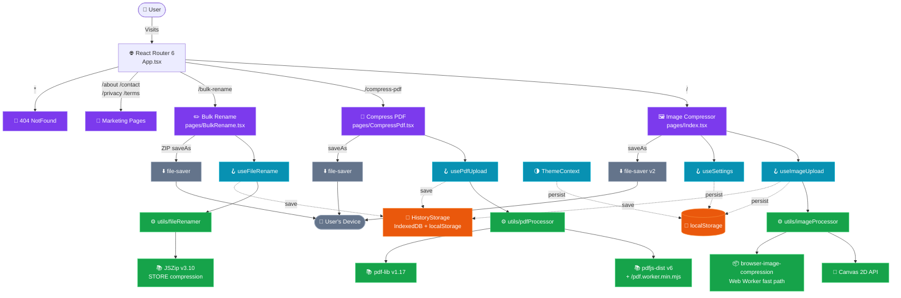
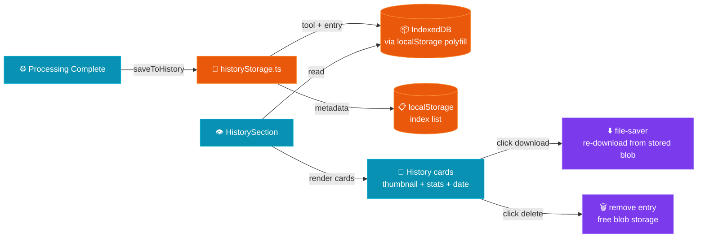

# ⚡ LS Image Compressor — Free Browser-Native File Toolkit

> **Compress images up to 90%, shrink PDFs, and rename hundreds of files in bulk — all 100% in your browser. No uploads, no accounts, no tracking. Zero servers.**

[](https://react.dev)
[](https://typescriptlang.org)
[](https://tailwindcss.com)
[](https://vitejs.dev)
[](https://www.framer.com/motion/)
[](#-testing)
[](https://choosealicense.com/licenses/mit/)
[](#)
[](#-system-architecture)
[](http://makeapullrequest.com)
[](https://img.ladestack.in)

---

## 📑 Table of Contents

- [🎯 What is LS Image Compressor?](#-what-is-ls-image-compressor)
- [🧰 Three Tools, One App](#-three-tools-one-app)
- [✨ Key Highlights](#-key-highlights)
- [🚀 Features](#-features)
  - [🖼️ Image Compressor (`/`)](#️-image-compressor-)
  - [📕 PDF Compressor (`/compress-pdf`)](#-pdf-compressor-compress-pdf)
  - [✏️ Bulk File Renamer (`/bulk-rename`)](#️-bulk-file-renamer-bulk-rename)
  - [📜 History & Re-Download](#-history--re-download)
  - [🛡️ Cross-Cutting Concerns](#️-cross-cutting-concerns)
- [🏗️ System Architecture](#️-system-architecture)
  - [🗺️ App-Wide Architecture](#️-app-wide-architecture)
  - [🖼️ Image Compression Pipeline](#️-image-compression-pipeline)
  - [📕 PDF Compression Pipeline](#-pdf-compression-pipeline)
  - [✏️ Bulk Rename Pipeline](#️-bulk-rename-pipeline)
  - [🗄️ History Storage Flow](#️-history-storage-flow)
  - [🛡️ Privacy Architecture](#️-privacy-architecture)
- [🛠️ Tech Stack](#️-tech-stack)
- [📊 Performance Stats](#-performance-stats)
- [🚀 Getting Started](#-getting-started)
- [⚙️ Configuration](#️-configuration)
- [📁 Project Structure](#-project-structure)
- [🧪 Testing](#-testing)
- [☁️ Deploy to Vercel](#️-deploy-to-vercel)
- [♿ Accessibility](#-accessibility)
- [🔒 Privacy & Security](#-privacy--security)
- [🌐 SEO & Performance](#-seo--performance)
- [📄 License](#-license)
- [🙏 Credits](#-credits)

---

## 🎯 What is LS Image Compressor?

**LS Image Compressor** is a **100% client-side** privacy-first file toolkit that runs three essential utilities entirely in the browser. Built with **React 18**, **TypeScript**, **Tailwind CSS**, and **Vite**, it provides a polished, accessible experience for common file tasks — without ever sending your data to a server.

| Tool | Route | Purpose | Max Inputs | Engine |
|------|-------|---------|------------|--------|
| 🖼️ **Image Compressor / Resizer / Converter** | `/` | Compress, resize, convert, rotate, mirror, grayscale, strip EXIF, target KB | **50** images × 25 MB (750 MB total) | Canvas API + `browser-image-compression` |
| 📕 **PDF Compressor** | `/compress-pdf` | Shrink PDFs by re-rendering pages as JPEG, with smart presets, DPI override, grayscale, page range | **5** PDFs × 100 MB | `pdfjs-dist` + `pdf-lib` |
| ✏️ **Bulk File Renamer** | `/bulk-rename` | Rename any file type with 13 stackable rules, live preview, safe sanitization | **100** files × 200 MB | Pure JS string engine + `jszip` |

> 🔐 **Privacy by default**: every byte stays on your device. Closing the tab is the only "delete" you need.

---

## ✨ Key Highlights

- 🔒 **100% Private** — Zero network requests at runtime. No API calls, no telemetry, no cookies
- ⚡ **Instant Processing** — No upload delays, no server round-trips. Files never leave your machine
- 🆓 **Free Forever** — No subscriptions, no hidden fees, no watermarks, no account required
- 🎯 **Smart Targeting** — Specify a target KB for images & PDFs; engine auto-discovers optimal quality
- 📦 **Batch + ZIP** — Process multiple files in parallel, download as a single ZIP archive
- 🧠 **Smart PDF Recommendation** — Classifies pages (text-heavy / image-heavy) and suggests ideal preset
- 📜 **History** — Previous compression sessions are saved locally for re-download
- 👁️ **Live Preview** — Side-by-side, slider, & toggle comparison views with zoom/pan
- ♿ **Accessible** — Full keyboard navigation, screen-reader support, semantic HTML
- 🌙 **Dark/Light Mode** — Theme persists via `localStorage`; no-FOUC inline script
- 🧩 **Code-Split** — PDF & ZIP libraries loaded only on the pages that need them
- 📱 **Fully Responsive** — Works on desktop, tablet, and mobile with a dedicated mobile action bar

---

## 🚀 Features

### 🖼️ Image Compressor (`/`)

The flagship tool — resize, recompress, and convert up to **50 images** at once (750 MB total) with social-media presets and a canvas-based transform pipeline.

#### 🗜️ Compression

- **🎚️ Quality Slider** — Adjustable **10–100%** with quick presets (Max / High / Balanced / Compact)
  - 🟢 **High (80–100%)** — Minimal compression, best quality
  - 🟡 **Balanced (50–79%)** — Great for web & social media (default: **75%**)
  - 🔴 **Aggressive (10–49%)** — Maximum compression for thumbnails
- **⚡ Auto Optimize** — Automatically selects the best quality for web delivery
- **🎯 Target File Size** — Specify max KB; engine iteratively reduces quality by 10% until target is met (max 5 iterations, floor at 10%)
- **📉 Live Stats** — Real-time per-file before/after size, reduction %, savings in KB with animated counters
- **🔁 Dual Engine** — Fast Web Worker path (`browser-image-compression`) with Canvas API fallback for transforms

#### 📐 Resize

- **🧮 Custom Dimensions** — Width/height inputs with pixel precision
- **🔗 Aspect Ratio Lock** — Auto-derives missing dimension from source aspect ratio
- **🎯 9 Social Media Presets** — One-click apply with **center-crop to fit** (no distortion)

| Platform | Preset | Dimensions |
|----------|--------|------------|
| 📸 Instagram Post | IG Post | 1080×1080 |
| 📱 Instagram Story | IG Story | 1080×1920 |
| 💼 LinkedIn Post | LinkedIn Post | 1200×627 |
| 💼 LinkedIn Banner | LI Banner | 1584×396 |
| 💬 WhatsApp DP | WhatsApp DP | 500×500 |
| 🐦 Twitter / X Post | Twitter Post | 1200×675 |
| 📘 Facebook Cover | FB Cover | 820×312 |
| 📺 YouTube Thumbnail | YT Thumb | 1280×720 |
| 🖥️ Full HD | Full HD | 1920×1080 |

#### 🔄 Format Conversion

| Format | Best For | Notes |
|--------|----------|-------|
| **⬜ Keep Original** | Compression only | No format change |
| **🟦 JPEG** | Photos, complex images | Universal compatibility, lossy |
| **🟩 PNG** | Transparency, graphics | Lossless, larger files |
| **🟨 WebP** ⭐ | Web performance | **~30% smaller** than JPEG at same quality |
| **🟪 AVIF** | Best compression | **~50% smaller** than JPEG; Chrome 85+ / FF 113+ / Safari 16+ |

#### 🔄 Transforms

- 🔁 **Rotation** — 0°, 90°, 180°, 270°
- 🪞 **Mirror / Flip** — Horizontal flip
- ⚫ **Grayscale** — BT.601 luma transform (`0.299 R + 0.587 G + 0.114 B`)
- 🛡️ **Strip EXIF** — Removes camera info, GPS, and metadata
- 🏷️ **Filename Tokens** — `{name}`, `{ext}`, `{format}`, `{w}`, `{h}`, `{q}`, `{index}`, `{date}`, `{size}` — all customizable

#### 📦 Batch Processing

- **50 images** per batch (750 MB total, 25 MB each)
- Drag & drop + click-to-browse + **`Ctrl+V` clipboard paste**
- Per-file status badges: Ready / Processing / Done / Failed
- Retry individual failed files without re-processing the batch
- Download single files or **Download All as ZIP**
- **Before/After comparison cards** with animated stat counters

---

### 📕 PDF Compressor (`/compress-pdf`)

Re-renders every page as a JPEG and rebuilds the document — the most reliable way to shrink image-heavy PDFs in the browser.

#### 🎚️ Compression Levels

| Level | JPEG Quality | Max Width | Scale | Best For |
|-------|--------------|-----------|-------|----------|
| 🚀 **Strong** | 40% | 1100 px | 1.25× | Emailing, sharing — smallest file |
| ⚡ **Balanced** ⭐ | 60% | 1700 px | 1.75× | Recommended default |
| ✨ **Light** | 82% | 2400 px | 2.25× | Best quality, still smaller |

#### ⚙️ Advanced Controls

- **🎚️ Custom Slider** — Fine-tune JPEG quality 10–95% (auto-switches to "Custom" preset)
- **🎯 Target Size (KB)** — Iterative quality reduction (5 iterations max) to hit target
- **📐 DPI Override** — 72 / 96 / 150 / 300 DPI (overrides preset scale)
- **⚫ Grayscale** — BT.601 luma conversion; saves ~25% on color image-heavy PDFs
- **🕵️ Strip Metadata** — Drops title, author, producer, creator from output
- **📑 Page Range** — Select specific pages (e.g., `1-5`, `12-20`); unselected pages are dropped
- **🏷️ Filename Tokens** — `{name}`, `{ext}`, `{format}`, `{pages}`, `{size}`, `{date}`, `{q}`, `{index}`

#### 🧠 Smart Recommendation Engine

When a PDF is dropped, the engine samples the first page and classifies it via edge + color analysis:

- **Soft-edge ratio** — blur detection
- **Hard-edge ratio** — text/sharp content
- **Color quantization** — 4-bit color palette count

**Logic**: `text-heavy` if `hardRatio > 0.15` or `(colors < 200 && hardRatio > 0.08)`; `image-heavy` if `softRatio > 0.3 && colors > 1500`

A **smart badge** appears next to the file — click to apply the recommended preset.

#### 📦 Batch & Preview

- **5 PDFs** per batch (100 MB each)
- Per-file page progress with live ETA
- **In-App Preview** — embedded `<iframe>` of compressed PDF
- Download single or all as ZIP
- **Confetti burst** on completion 🎉

> ⚠️ **Trade-off**: Pages become image-only JPEGs embedded in PDF — text is no longer selectable/searchable. Document *appearance* is preserved.

---

### ✏️ Bulk File Renamer (`/bulk-rename`)

Pure string-manipulation engine with live preview. Works for **any** file type — images, docs, archives, source code.

#### 🎛️ 13 Stackable Rule Types

| # | Rule | What it does | Options |
|---|------|--------------|---------|
| 1 | 🔍 **Find & Replace** | Replace text or regex pattern | Plain / Regex, Case-insensitive toggle |
| 2 | ✏️ **Add Prefix** | Prepend text to filename | Text input |
| 3 | ✏️ **Add Suffix** | Append text before extension | Text input |
| 4 | 🔢 **Numbering** | Sequential numbering | Start/End position, separator, start value, zero-pad width (0–10) |
| 5 | Aa **Change Case** | Transform letter case | `lower` / `UPPER` / `Title Case` / `Sentence case` |
| 6 | 📏 **Whitespace** | Replace or strip spaces | Dash `a-b` / Underscore `a_b` / Remove `ab` / Collapse |
| 7 | 🧹 **Remove Chars** | Strip specific characters | Any character set (regex-escaped) |
| 8 | 📅 **Date Stamp** | Insert `lastModified` or current date | 7 formats, separator, Prefix/Suffix, "use now" override |
| 9 | 🧷 **Insert At** | Inject text at index | Index (negative = from end), text |
| 10 | ✂️ **Trim / Truncate** | Strip ends or cap length | Start/End/Both/Truncate, count, optional `…` ellipsis |
| 11 | 🗂️ **Replace Extension** | Set, lower, upper, or remove extension | Mode: Set / Lower / Upper / Remove |
| 12 | 🔁 **Counter From Name** | Re-sequence existing number in filename | First/Last match, Start/End position, separator, pad, fallback start |
| 13 | 🪞 **Reverse Name** | Flip the base name backwards | — |

#### 👁️ Live Preview & Safety

- **Before/After diff** — Original struck through, changed segment highlighted with color pill
- **Extensions are always preserved** untouched
- **Sanitization** — Strips illegal OS chars (`<>:"/\|?*` + control chars), collapses underscores, trims dots, caps at 200 chars
- **De-duplication** — Colliding names get `(2)`, `(3)`, etc. appended
- **Download as ZIP** with STORE compression (fast, no CPU waste on already-compressed files)

#### 💡 Common Recipes

| Recipe | Rules to stack |
|--------|----------------|
| **Screenshots to share** | Find&Replace `Screenshot`→``, Case `lower`, Whitespace `dash` |
| **Date-stamped batch** | Date `format=YYYY-MM-DD position=start separator=_` |
| **URL-safe slugs** | Whitespace `dash`, Remove Chars `!@#$%^&*()`, Case `lower` |
| **Re-sequence numbering** | Counter From Name `where=last fallbackStart=1 pad=2` |
| **Normalize extensions** | Replace Extension `mode=lower` |
| **Cap long names** | Trim `mode=truncate maxLength=40 ellipsis=true` |

---

### 📜 History & Re-Download

Processed files are saved to `localStorage` via **IndexedDB-backed history storage** so you can re-download previous compression results without re-processing.

- Stored per tool (image / pdf / rename)
- Saves original name, processed blob (as base64), dimensions, quality, reduction %
- Re-download or delete individual entries
- History section at the bottom of each tool page

---

### 🛡️ Cross-Cutting Concerns

- **⚠️ Large file warnings** — Toast notification when files exceed recommended sizes
- **🎞️ Animated-GIF notice** — Warns that GIFs will become static via canvas re-encoding
- **🚧 Per-file error isolation** — Failed files show individual error messages; batch processing continues
- **🔄 Graceful fallbacks** — Canvas API path used when primary engine can't handle a format
- **🧹 Memory cleanup** — Object URLs tracked in `useRef<Set>` and revoked on unmount; PDF pages eagerly `cleanup()`-ed
- **🐢 Event-loop yields** — PDF processing yields every 3 pages to keep UI responsive
- **🛡️ Filename sanitization** — Every output filename is cleaned for cross-platform safety

---

## 🏗️ System Architecture

LS Image Compressor follows a **fully client-side, layered, multi-route architecture**. All layers run in the browser — there is **no backend service, no database, and no telemetry endpoint**.

### 🗺️ App-Wide Architecture



### 🖼️ Image Compression Pipeline

```mermaid
flowchart TB
    Drop[📤 User drops / pastes files] -->|validateBatch| Queue[📋 useImageUpload<br/>file queue]
    Queue --> Set[⚙️ useSettings<br/>tabs: Quality / Resize / Format / Output]
    Set -->|"processAll()"| Process[⚙️ imageProcessor.processImage]

    Process --> Check{Has transforms,<br/>resize, or<br/>format change?}
    Check -->|Yes| Canvas[🎨 Canvas API path]
    Check -->|No| BIC[📦 browser-image-compression<br/>Web Worker path]

    Canvas --> Calc[📐 calcDimensions<br/>center-crop to aspect ratio]
    Calc --> Draw[🖌️ OffscreenCanvas<br/>imageSmoothingQuality: high]
    Draw --> Transforms{rotation,<br/>mirror,<br/>grayscale?}
    Transforms -->|Yes| Apply[🔄 ctx.rotate / ctx.scale<br/>BT.601 luma pixel loop]
    Apply --> Blob[💾 canvas.toBlob]
    Transforms -->|No| Blob

    BIC --> Lib[📚 maxSizeMB + initialQuality]
    Lib --> Blob

    Blob --> Target{targetSizeKB set<br/>& blob too large?}
    Target -->|Yes, q > 10| Reduce[📉 quality -= 10%<br/>re-encode]
    Reduce --> Blob
    Target -->|Yes, q <= 10| Accept[⚠️ accept best effort]
    Target -->|No target / fits| Accept

    Accept --> Done[✅ ProcessResult<br/>{blob, w, h, reduction, quality}]
    Done --> Preview[👁️ ObjectURL → processedPreview]
    Done --> File[📁 toDownloadFile<br/>filename tokens applied]

    Preview --> Result[📊 ResultsSection<br/>animated stat counters]
    File --> Result
    Result -->|single| DL1[⬇️ file-saver]
    Result -->|batch ZIP| Zip[🗂️ JSZip<br/>folder → generateAsync]
    Zip --> DL2[⬇️ file-saver ZIP]

    classDef ui fill:#7c3aed,stroke:#a78bfa,color:#fff
    classDef logic fill:#0891b2,stroke:#06b6d4,color:#fff
    classDef util fill:#16a34a,stroke:#4ade80,color:#fff
    classDef out fill:#ea580c,stroke:#fb923c,color:#fff

    class Drop,Queue,Set,Result ui
    class Process,Check,Canvas,Calc,Draw,Transforms,Apply,Blob,Target,Reduce,Accept logic
    class BIC,Lib,Done,Preview,File,Zip util
    class DL1,DL2 out
```

### 📕 PDF Compression Pipeline

```mermaid
flowchart TB
    Drop[📤 User drops PDFs] --> Hook[🪝 usePdfUpload]
    Hook --> Probe[🔍 lazy import pdfjs-dist<br/>GlobalWorkerOptions setup]
    Probe --> Meta[📋 extractPdfMetadata<br/>page count, thumbnail,<br/>smart recommendation]
    Meta --> Queue[📋 file queue]
    Queue --> Set[⚙️ PdfSettingsPanel<br/>preset / slider / DPI /<br/>gray / page range / tokens]

    Set -->|trigger| Proc[⚙️ pdfProcessor.compressPdf]
    Proc --> Load[📚 pdfjs.getDocument<br/>slice(0) to preserve original]
    Load --> Loop{For each page<br/>in range}

    Loop --> Render[🎨 renderPageToJpeg<br/>canvas + toBlob('image/jpeg')]
    Render --> Embed[📄 pdf-lib: outDoc.embedJpg]
    Embed --> Add[➕ addPage + drawImage<br/>at page dimensions]
    Add --> Clean[🧹 page.cleanup()]
    Clean --> Yield{Every 3 pages?}
    Yield -->|No| Loop
    Yield -->|Yes| Tick[⏱️ await setTimeout(0)<br/>yield to UI thread]
    Tick --> Loop

    Loop -->|All pages done| OutDoc[💾 outDoc.save<br/>useObjectStreams: true]
    OutDoc --> Blob[📦 application/pdf Blob]

    Blob --> Result[📊 PdfResultsSection]
    Result --> Preview[👁️ iframe ObjectURL preview]
    Result --> DL1[⬇️ single file-saver]
    Result --> Zip[🗂️ JSZip → ZIP]
    Zip --> DL2[⬇️ file-saver ZIP]

    Worker[/⚙️ pdf.worker.min.mjs<br/>served from public/<br/>1.2 MB static asset/] -.->|Web Worker| Load

    classDef ui fill:#7c3aed,stroke:#a78bfa,color:#fff
    classDef logic fill:#0891b2,stroke:#06b6d4,color:#fff
    classDef util fill:#16a34a,stroke:#4ade80,color:#fff
    classDef out fill:#ea580c,stroke:#fb923c,color:#fff

    class Drop,Queue,Set,Result,Preview ui
    class Hook,Probe,Meta,Proc,Load,Loop,Yield logic
    class Render,Embed,Add,Clean,OutDoc,Blob,Zip,Tick,Worker util
    class DL1,DL2 out
```

### ✏️ Bulk Rename Pipeline

```mermaid
flowchart TB
    Drop[📤 User drops any files] --> Hook[🪝 useFileRename]
    Rules[⚙️ FileRenameRuleBuilder<br/>13 rule types, reorderable] --> Hook

    Hook --> Plan[🧮 useMemo: buildRenamePlan]
    Plan --> Split[✂️ For each file:<br/>splitExtension]

    Split --> BaseRules[📐 apply all base rules in order]
    BaseRules --> R1[🔍 Find & Replace]
    BaseRules --> R2[✏️ Prefix / Suffix]
    BaseRules --> R3[🔢 Numbering]
    BaseRules --> R4[Aa Change Case]
    BaseRules --> R5[📏 Whitespace]
    BaseRules --> R6[🧹 Remove Chars]
    BaseRules --> R7[📅 Date Stamp]
    BaseRules --> R8[🧷 Insert At]
    BaseRules --> R9[✂️ Trim / Truncate]
    BaseRules --> R10[🔁 Counter From Name]
    BaseRules --> R11[🪞 Reverse Name]

    R1 --> Compose[🧩 newBase + newExt]
    R2 --> Compose
    R3 --> Compose
    R4 --> Compose
    R5 --> Compose
    R6 --> Compose
    R7 --> Compose
    R8 --> Compose
    R9 --> Compose
    R10 --> Compose
    R11 --> Compose

    ExtRules[🗂️ Extension rules] --> NewExt[🔧 applyExtRules]
    NewExt --> Compose

    Compose --> Dedup{Collision?<br/>lowercased name seen?}
    Dedup -->|Yes| Suffix["➕ append (2), (3)…"]
    Dedup -->|No| Keep[✅ keep]
    Suffix --> Entry[📥 push RenamePlanEntry{changed, diff}]
    Keep --> Entry

    Entry --> Preview[👁️ FileRenamePreviewList<br/>highlightDiff pills]
    Preview --> Click[🖱️ Download ZIP]

    Click --> Sanitize[🛡️ sanitizeFileName<br/>strip <>:"/\|?*<br/>control chars, trim dots]
    Sanitize --> Zip[🗂️ JSZip<br/>STORE compression<br/>(no re-compression)]
    Zip --> Progress[📊 Progress: 0-90% add,<br/>90-100% generateAsync]
    Progress --> DL[⬇️ file-saver download]
    DL --> Disk([💽 User's Device])

    classDef ui fill:#7c3aed,stroke:#a78bfa,color:#fff
    classDef logic fill:#0891b2,stroke:#06b6d4,color:#fff
    classDef util fill:#16a34a,stroke:#4ade80,color:#fff
    classDef out fill:#ea580c,stroke:#fb923c,color:#fff

    class Drop,Rules,Preview,Click ui
    class Hook,Plan,Split,BaseRules,ExtRules,Compose,Dedup,Suffix logic
    class R1,R2,R3,R4,R5,R6,R7,R8,R9,R10,R11,NewExt,Entry,Keep,Sanitize,Zip,Progress util
    class DL,Disk out
```

### 🗄️ History Storage Flow



### 🛡️ Privacy Architecture


> 🔐 **Zero data ever leaves the user's device.** No API calls, no telemetry, no third-party requests at runtime. The only network traffic is loading the static HTML/JS/CSS/pdf-worker bundle from the CDN.

---

## 🛠️ Tech Stack

### 🖥️ Frontend (Core)

| Technology | Version | Purpose |
|------------|---------|---------|
| **React** | 18.3.1 | UI framework & component model |
| **TypeScript** | 5.8.x | Type safety (strict mode OFF — intentional for prototyping) |
| **Vite** | 5.4.x | Build tool with SWC-based HMR |
| **Tailwind CSS** | 3.4.x | Utility-first responsive styling via CSS variables |
| **shadcn/ui** | Latest | Accessible Radix UI primitives with `cn()` helper |
| **React Router** | 6.30.x | Client-side SPA routing with lazy loading |
| **Framer Motion** | 12.x | Declarative animations & gesture handling |

### 📚 Feature Libraries

| Package | Used By | Purpose |
|---------|---------|---------|
| `browser-image-compression` | Image tool | Client-side image compression via Web Worker |
| `pdfjs-dist` | PDF tool | PDF parsing & per-page canvas rendering |
| `pdf-lib` | PDF tool | PDF document construction & serialization |
| `jszip` | Image / PDF / Rename | ZIP archive generation (STORE compression) |
| `file-saver` | All | Cross-browser `saveAs()` file download trigger |
| `lucide-react` | All | Tree-shakable icon set (primary) |
| `@phosphor-icons/react` | Marketing pages | Alternative icon set for heroes & features |
| `sonner` | All | Toast notification system |
| `next-themes` | All | Theme resolution infrastructure |
| `date-fns` | (Installed) | Date formatting (not actively used) |
| `zod` | (Installed) | Schema validation (not actively used) |
| `react-hook-form` | (Installed) | Form state management (not actively used) |
| `@hookform/resolvers` | (Installed) | Form validation resolvers (not actively used) |
| `@tanstack/react-query` | (Installed) | Async state (not actively used — kept for future) |
| `@radix-ui/*` | All | 20+ accessible UI primitives (accordion, dialog, slider, tabs, tooltip, etc.) |

### 🧰 Development & Build Tools

| Tool | Version | Purpose |
|------|---------|---------|
| **ESLint** | 9.x | Flat-config linting with `typescript-eslint` |
| **Vitest** | 3.x | Unit & integration test runner (jsdom env) |
| **Testing Library** | 16.x | React component testing utilities |
| **jsdom** | 20.x | Headless browser environment for tests |
| **PostCSS** | 8.x | CSS transformation pipeline |
| **Autoprefixer** | 10.x | Vendor prefix automation |
| **SWC** | — | Rust-based JSX/TS compiler (via `@vitejs/plugin-react-swc`) |
| **Lovable Tagger** | 1.x | Dev-only component tagging for visual debugging |
| **sharp** | 0.34.x | OG image generation script (`scripts/generate-og-images.mjs`) |

### 🚀 Deploy & Analytics

| Service | Purpose |
|---------|---------|
| **Vercel** | Hosting, SPA rewrites, edge CDN, SSL |
| **Vercel Analytics** | Cookieless, privacy-friendly page stats (idle-loaded) |
| **Vercel Speed Insights** | Real-user performance monitoring (idle-loaded) |

---

## 📊 Performance Stats

### 🖼️ Image Compressor

| Metric | Value |
|--------|-------|
| 🗜️ **Compression Ratio** | Up to **90%** file size reduction |
| 📦 **Max Batch Size** | **50 images** (750 MB total, 25 MB each) |
| 📥 **Supported Input** | JPG, PNG, WebP, AVIF, GIF, BMP |
| 📤 **Output Formats** | JPEG, PNG, WebP, AVIF, Original |
| 📐 **Max Resolution** | Browser memory limited |
| ☁️ **Server Uploads** | **Zero** — fully client-side |
| 🎯 **Default Quality** | 75% (Auto-Optimize mode) |
| ⚡ **Processing** | Web Worker fast path + Canvas fallback |

### 📕 PDF Compressor

| Metric | Value |
|--------|-------|
| 🗜️ **Typical Reduction** | 50–85% for image-heavy PDFs |
| 📦 **Max Batch** | **5 PDFs** per session |
| 📄 **Per-File Limit** | 100 MB |
| 🎚️ **Quality Range** | 10–95% JPEG |
| 📐 **Max Render Width** | 2400 px (Light) / 1100 px (Strong) |
| 🧠 **Memory Strategy** | Eager `page.cleanup()` + event loop yield every 3 pages |
| ⚡ **Code-Split** | `pdfjs-dist` + `pdf-lib` (~470 KB) loaded on demand only |

### ✏️ Bulk Rename

| Metric | Value |
|--------|-------|
| 📦 **Max Files** | **100 files** per session |
| 📥 **Per-File Limit** | 200 MB |
| 🎛️ **Rule Types** | **13** stackable, reorderable rules |
| 🔀 **Rule Application** | Sequential in order; extension rules in separate pass |
| 👁️ **Live Preview** | Diff-highlighted per file with `highlightDiff()` |
| 🛡️ **Safety** | Extensions preserved, illegal chars stripped, names de-duplicated |
| 📤 **Output** | ZIP with STORE compression (instant, no re-compression waste) |

### 🌍 Global

| Metric | Value |
|--------|-------|
| 🧠 **Memory Management** | Object URLs tracked in `useRef<Set>` & auto-revoked on unmount |
| ⚡ **Lazy Loading** | Code-split by route: `vendor-pdf`, `vendor-zip`, `vendor-image`, `vendor-motion`, `vendor-react` |
| 🧪 **Test Coverage** | **228 test calls** across 6 test modules |
| 🚀 **Dev Server** | Port `8080` with SWC-based HMR |
| 📦 **Bundle Splitting** | 5 manual chunks + default chunk |

---

## 🚀 Getting Started

### ✅ Prerequisites

- **Node.js** ≥ 20.x
- **npm** (bundled) **or** **bun** (faster alternative)
- **Git**

### 📥 Installation

```bash
# Clone the repository
git clone https://github.com/girishlade111/image-squeeze-express.git

# Navigate into the project
cd image-squeeze-express

# Install dependencies
npm install
# or (faster with bun)
bun install
```

### ▶️ Development

```bash
npm run dev
# or
bun dev
```

> 🌐 **App URL**: `http://localhost:8080`
> ⚡ **HMR**: Enabled via SWC — changes hot-reload instantly

### 🏗️ Production Build

```bash
npm run build          # Output → dist/
npm run build:dev      # Unminified dev build
npm run preview        # Preview production build locally
```

### 🧪 Testing

```bash
npm run test            # Run once (CI)
npm run test:watch      # Watch mode
npm run lint            # ESLint
```

### 📜 Available Scripts

| Script | Description |
|--------|-------------|
| `npm run dev` | Start Vite dev server with HMR on port `8080` |
| `npm run build` | Build production bundle to `dist/` |
| `npm run build:dev` | Build in development mode (unminified) |
| `npm run preview` | Preview production build locally |
| `npm run lint` | Run ESLint flat config across the project |
| `npm run test` | Run Vitest test suite once |
| `npm run test:watch` | Run Vitest in watch mode |
| `npm run og:gen` | Regenerate 6 OG images via `satori` + `sharp` |
| `npm run og:optimize` | Re-encode profile image to AVIF/WebP |

---

## ⚙️ Configuration

### 🎨 Theme Colors

All theme tokens are defined as CSS custom properties in `src/index.css`. The app uses a **monochrome greyscale** palette (all legacy aliases remapped):

```css
:root {
  --background: 0 0% 100%;       /* Light mode */
  --foreground: 0 0% 9%;
  --primary: 0 0% 9%;            /* Near-black */
  --accent: 0 0% 15%;
  --border: 0 0% 90%;
  --radius: 0.625rem;
  /* Legacy aliases remapped to greyscale */
  --indigo: 0 0% 9%;
  --teal: 0 0% 15%;
  --violet: 0 0% 9%;
  --brand: 0 0% 9%;
  --brand-2: 0 0% 15%;
}

.dark {
  --background: 0 0% 6%;         /* Near-black dark mode */
  --foreground: 0 0% 96%;
  --primary: 0 0% 96%;           /* Near-white */
  --accent: 0 0% 88%;
  --border: 0 0% 14%;
}
```

### 🌀 Custom Tailwind Extensions

Defined in `tailwind.config.ts`:

| Keyframes | Purpose |
|-----------|---------|
| `accordion-down` / `accordion-up` | Radix accordion height animation |
| `pulse-glow` | Box-shadow pulse effect |
| `fade-in-up` | Opacity + translateY(24px → 0) |
| `shimmer` | translateX(-100% → 100%) shimmer overlay |
| `float` | Gentle y-axis floating (hero blobs) |

### 💾 Settings Persistence

| localStorage Key | Stores | Default | Type |
|------------------|--------|---------|------|
| `ls-image-compressor-settings` | Image compression preferences | `{ quality: 75, outputFormat: 'webp', ... }` | JSON |
| `ls-image-compressor-theme` | Dark/light mode | `dark` | `"dark"` / `"light"` |

#### Default Image Settings

| Setting | Default | Range |
|---------|---------|-------|
| `quality` | `75` | 10–100 |
| `autoOptimize` | `true` | boolean |
| `outputFormat` | `'webp'` | `jpeg` / `png` / `webp` / `avif` / `original` |
| `targetSizeKB` | `null` | number / null |
| `stripEXIF` | `true` | boolean |
| `grayscale` | `false` | boolean |
| `rotation` | `0` | 0 / 90 / 180 / 270 |
| `mirror` | `false` | boolean |
| `lockAspectRatio` | `true` | boolean |
| `filenamePattern` | `'{name}_q{q}.{format}'` | token string |

#### Default PDF Settings

| Setting | Default |
|---------|---------|
| `preset` | `'medium'` (60% quality, 1700 px max width, 1.75× scale) |
| `output` | `image/jpeg` per page, rebuilt with `pdf-lib` |
| `workerSrc` | `/pdf.worker.min.mjs` (static asset) |

### ⚙️ Vite Config Highlights

Defined in `vite.config.ts`:

| Option | Value | Notes |
|--------|-------|-------|
| `server.host` | `"0.0.0.0"` | Listen on all interfaces |
| `server.port` | `8080` | Dev server port |
| `server.hmr.overlay` | `false` | Disable error overlay for canvas/preview errors |
| `resolve.alias` | `"@" → ./src` | Path alias |
| `build.manualChunks` | 5 vendor chunks | See chunk strategy below |

#### Manual Chunk Strategy

| Chunk Name | Contents | Loaded On |
|------------|----------|-----------|
| `vendor-pdf` | `pdfjs-dist` + `pdf-lib` | `/compress-pdf` |
| `vendor-zip` | `jszip` + `file-saver` | Results sections, `/bulk-rename` |
| `vendor-image` | `browser-image-compression` | Home page image processing |
| `vendor-react` | `react` + `react-dom` + `react-router-dom` | All pages |
| `vendor-motion` | `framer-motion` | All pages (animations) |

---

## 📁 Project Structure

```
image-squeeze-express/
├── index.html                         # SEO + theme bootstrap + root mount
├── package.json                       # Dependencies & scripts
├── vite.config.ts                     # @ alias, port 8080, manualChunks
├── vitest.config.ts                   # jsdom + @ alias + setup
├── tailwind.config.ts                 # CSS-var colors, animations
├── tsconfig.json / .app / .node.json  # TypeScript config (strict: false)
├── eslint.config.js                   # Flat config (lenient)
├── postcss.config.js
├── components.json                    # shadcn/ui config
├── vercel.json                        # SPA rewrites + 1y cache + security headers
│
├── public/
│   ├── favicon.svg / *.png / apple-touch-icon.*  # PWA icons
│   ├── logo-mark.svg                  # ⚡ Logo
│   ├── pdf.worker.min.mjs            # pdfjs worker (1.2 MB)
│   ├── robots.txt                    # 7 KB bot directives
│   ├── sitemap*.xml / image-sitemap.xml
│   └── og-*.{png,svg}                # 6 OG images
│
├── scripts/
│   ├── generate-og-images.mjs         # satori + sharp OG generator
│   └── optimize-profile.mjs          # sharp → AVIF/WebP profile photo
│
├── src/
│   ├── main.tsx                      # ReactDOM.createRoot mount
│   ├── App.tsx                       # Providers + routes (lazy) + ErrorBoundary
│   ├── VercelAnalytics.tsx           # Idle-loaded analytics + speed-insights
│   ├── index.css                     # Tailwind + theme CSS vars + utilities
│   │
│   ├── assets/
│   │   └── profile.{webp,avif}       # @2x variants for About page
│   │
│   ├── components/
│   │   ├── Header.tsx                # Fixed nav, mobile drawer, theme toggle, prefetch
│   │   ├── Footer.tsx                # 4-column footer + socials
│   │   ├── ToolHero.tsx              # Shared hero (gradient mesh + floating shapes)
│   │   ├── HeroSection.tsx           # Image tool hero wrapper
│   │   ├── UploadZone.tsx            # Image drop zone
│   │   ├── ImageQueue.tsx            # Image file grid with per-file status
│   │   ├── SettingsPanel.tsx         # Quality / Resize / Format / Output tabs
│   │   ├── ResultsSection.tsx        # Before/after cards + ZIP download + share
│   │   ├── ImageInspector.tsx        # Image preview dialog
│   │   ├── ComparisonView.tsx        # Side / Slider / Toggle before-after + zoom
│   │   ├── PdfUploadZone.tsx         # PDF drop zone
│   │   ├── PdfQueue.tsx              # PDF file list + smart rec badge
│   │   ├── PdfSettingsPanel.tsx      # Presets + slider + DPI/target/gray/range
│   │   ├── PdfResultsSection.tsx     # PDF results + iframe preview + confetti
│   │   ├── PdfInspector.tsx          # PDF preview dialog + smart recommendation
│   │   ├── FileRenameUploadZone.tsx  # Any-file drop zone
│   │   ├── FileRenameRuleBuilder.tsx # 13-rule stack builder (845 lines)
│   │   ├── FileRenamePreviewList.tsx # Live rename diff preview
│   │   ├── HistorySection.tsx        # Re-download previous results
│   │   ├── PrimaryCTA.tsx            # Reusable gradient CTA button
│   │   ├── TrustBar.tsx              # "Why teams trust" 6-tile strip
│   │   ├── HowItWorks.tsx            # 3-step explainer
│   │   ├── FeaturesGrid.tsx          # Bento 6-card feature grid
│   │   ├── FAQSection.tsx            # 12 Q&A accordion
│   │   ├── DocumentTitle.tsx         # Per-route <title> + meta + JSON-LD
│   │   ├── LazySection.tsx           # IntersectionObserver gate + requestIdleCallback
│   │   ├── EmptyState.tsx            # Centered empty state card
│   │   ├── ErrorBoundary.tsx         # Route-level error + ChunkLoadError catch
│   │   ├── MobileActionBar.tsx       # Sticky mobile-only CTA
│   │   ├── PageDropOverlay.tsx       # Full-page drag overlay
│   │   ├── ScrollToTop.tsx           # Floating back-to-top button
│   │   ├── Skeleton.tsx              # Route / Block / Card / Queue skeletons
│   │   ├── ProfileImage.tsx          # <picture> wrapper with gradient frame
│   │   ├── NavLink.tsx               # NavLink wrapper
│   │   └── ui/                       # 49 shadcn/ui primitives (some unused)
│   │
│   ├── config/
│   │   └── seo.ts                    # Per-page SEO registry (8 pages)
│   │
│   ├── contexts/
│   │   └── ThemeContext.tsx           # Dark/light toggle + localStorage
│   │
│   ├── hooks/
│   │   ├── useImageUpload.ts         # Image batch state machine
│   │   ├── usePdfUpload.ts           # PDF batch state machine
│   │   ├── useFileRename.ts          # Renamer state machine + ZIP builder
│   │   ├── useSettings.ts            # Persistent image settings
│   │   ├── useHistory.ts             # History read/download/delete
│   │   ├── useClipboardPaste.ts      # Global Ctrl+V handler
│   │   ├── usePageDropZone.ts        # Document drag-and-drop tracker
│   │   ├── use-toast.ts              # Radix toast reducer (legacy)
│   │   └── use-mobile.tsx            # < 768px viewport detection
│   │
│   ├── lib/
│   │   ├── utils.ts                  # cn() helper
│   │   ├── motion.ts                 # Shared framer-motion variants
│   │   └── prefetch.ts               # usePrefetchOnHover + prefetchOnIdle
│   │
│   ├── pages/
│   │   ├── Index.tsx                 # 🖼️ Image tool (`/`)
│   │   ├── CompressPdf.tsx           # 📕 PDF tool (`/compress-pdf`)
│   │   ├── BulkRename.tsx            # ✏️ Rename tool (`/bulk-rename`)
│   │   ├── About.tsx                 # Story, stats, philosophy (1687 lines)
│   │   ├── Contact.tsx               # Channels + FAQ
│   │   ├── PrivacyPolicy.tsx         # Privacy policy (Mar 2026)
│   │   ├── TermsOfService.tsx        # Terms of service (Mar 2026)
│   │   └── NotFound.tsx              # 404 with motion
│   │
│   ├── utils/
│   │   ├── imageProcessor.ts         # Canvas pipeline + filename tokens
│   │   ├── pdfProcessor.ts           # pdfjs → JPEG → pdf-lib + smart rec
│   │   ├── pdfFormat.ts              # Quality presets + token docs
│   │   ├── fileRenamer.ts            # 13-rule rename engine + sanitize
│   │   ├── batchValidation.ts        # Batch validation (50 files, 750 MB)
│   │   └── historyStorage.ts         # IndexedDB + localStorage history
│   │
│   └── test/
│       ├── setup.ts                  # matchMedia polyfill + jest-dom
│       ├── batchValidation.test.ts   # 16 tests
│       ├── example.test.ts           # 2 tests
│       ├── fileRenamer.test.ts       # 83 tests
│       ├── historyStorage.test.ts    # 30 tests
│       ├── imageProcessor.test.ts    # 72 tests
│       └── pdfProcessor.test.ts      # 25 tests
│
├── bun.lock / bun.lockb              # Bun lockfiles
└── package-lock.json                  # npm lockfile
```

---

## 🧪 Testing

The project ships with **228 test calls** across 6 test modules, all pure-function tests running in `jsdom` without browser shims.

| Module | Tests | What it covers |
|--------|-------|----------------|
| `imageProcessor.test.ts` | 72 | `formatFileSize`, `getCompressionRatio`, `calcDimensions` (center-crop), `estimateQualityForSize`, `isFormatSupported`, filename token replacement, AVIF detection |
| `fileRenamer.test.ts` | 83 | `splitExtension`, all **13** rule types individually and in combination, rule ordering, dedup with collisions, `sanitizeFileName` edge cases (hidden files, trailing dots, illegal chars) |
| `pdfProcessor.test.ts` | 25 | `formatBytes`, `getReductionRatio`, `getQualityPresetSettings`, preset bounds, filename pattern + token replacement, filename sanitization |
| `historyStorage.test.ts` | 30 | Save/load/delete history entries, per-tool isolation, data integrity, blob storage limits |
| `batchValidation.test.ts` | 16 | Overflow, oversized skip, GIF detection, total-cap warning, FIFO ordering |
| `example.test.ts` | 2 | Basic sanity check |

### ▶️ Run Tests

```bash
npm run test           # Run once
npm run test:watch     # Watch mode
```

---

## ☁️ Deploy to Vercel

LS Image Compressor is a **fully client-side** Vite SPA — no server, no API routes, no environment variables. It deploys to Vercel as a static site.

### ⚡ One-Click Deploy

[](https://vercel.com/new/clone?repository-url=https%3A%2F%2Fgithub.com%2Fgirishlade%2Fimage-squeeze-express&project-name=image-squeeze-express&repository-name=image-squeeze-express)

### 🔧 Manual Deploy

```bash
npm i -g vercel
vercel                # Preview deployment
vercel --prod         # Production
```

### 📋 Build Settings (auto-detected)

| Setting | Value |
|---------|-------|
| **Framework Preset** | `Vite` |
| **Build Command** | `npm run build` |
| **Output Directory** | `dist` |
| **Install Command** | `npm install` |
| **Node Version** | `20.x` |

### 🔁 SPA Routing

`vercel.json` rewrites all paths to `/index.html` for deep-link support:

```json
{ "rewrites": [{ "source": "/(.*)", "destination": "/index.html" }] }
```

### 🛡️ Security & Cache Headers

| Header | Value |
|--------|-------|
| `X-Content-Type-Options` | `nosniff` |
| `X-Frame-Options` | `DENY` |
| `Referrer-Policy` | `strict-origin-when-cross-origin` |
| `Permissions-Policy` | `camera=(), microphone=(), geolocation=(), interest-cohort=()` |
| `Cache-Control` (assets) | `public, max-age=31536000, immutable` |

### 🌍 Custom Domain

The canonical deployment lives at **[img.ladestack.in](https://img.ladestack.in)**

---

## ♿ Accessibility

- ✅ WCAG AA color contrast compliance
- ✅ `aria-label` on all icon-only buttons
- ✅ `role="button"` with full keyboard (Enter/Space) support
- ✅ `aria-pressed` / `aria-checked` on toggle controls
- ✅ `aria-expanded` + `aria-controls` on mobile nav & accordions
- ✅ Semantic HTML5 (`<nav>`, `<section>`, `<header>`, `<footer>`, `<main>`)
- ✅ `focus-visible` ring styles for keyboard navigation
- ✅ Proper `alt` text on all images
- ✅ `aria-live="polite"` on progress regions
- ✅ Skip-link styling for screen readers

---

## 🔒 Privacy & Security

- ✅ **Zero server uploads** — all processing happens in-browser
- ✅ **No tracking** — no cookies, no analytics cookies, no fingerprinting
- ✅ **No account required** — fully anonymous usage
- ✅ **Memory cleanup** — object URLs revoked on unmount
- ✅ **No third-party requests at runtime** — no CDN fonts after initial load
- ✅ **PDF worker bundled as static asset** — no external worker host
- ✅ **Open source** — full transparency, audit the code yourself
- ✅ **Vercel Analytics** — cookieless, DNT-aware, no personal data collected

---

## 🌐 SEO & Performance

- ✅ Per-route `<title>` + `<meta>` via `DocumentTitle` component
- ✅ Open Graph + Twitter Cards for all 8 pages
- ✅ JSON-LD structured data (WebApplication, FAQPage, BreadcrumbList, Organization, Article)
- ✅ Canonical URL per page
- ✅ Dedicated OG images per page (6 PNG/SVG pairs in `public/`)
- ✅ Lazy-loaded routes with `<Suspense>` + `<RouteSkeleton />`
- ✅ Code-split vendor chunks to minimize initial bundle
- ✅ IntersectionObserver-based lazy section mounting
- ✅ `requestIdleCallback` for non-critical JS (analytics, below-fold sections)
- ✅ `prefetchOnIdle` for Vercel Analytics + Speed Insights
- ✅ `usePrefetchOnHover` for route chunk warming on nav hover

---

## 📄 License

**MIT License** — Built with ❤️ by [Lade Stack](https://ladestack.in)

```
MIT License

Copyright (c) 2026 Girish Lade

Permission is hereby granted, free of charge, to any person obtaining a copy
of this software and associated documentation files (the "Software"), to deal
in the Software without restriction, including without limitation the rights
to use, copy, modify, merge, publish, distribute, sublicense, and/or sell
copies of the Software, and to permit persons to whom the Software is
furnished to do so, subject to the following conditions:

The above copyright notice and this permission notice shall be included in all
copies or substantial portions of the Software.

THE SOFTWARE IS PROVIDED "AS IS", WITHOUT WARRANTY OF ANY KIND, EXPRESS OR
IMPLIED, INCLUDING BUT NOT LIMITED TO THE WARRANTIES OF MERCHANTABILITY,
FITNESS FOR A PARTICULAR PURPOSE AND NONINFRINGEMENT. IN NO EVENT SHALL THE
AUTHORS OR COPYRIGHT HOLDERS BE LIABLE FOR ANY CLAIM, DAMAGES OR OTHER
LIABILITY, WHETHER IN AN ACTION OF CONTRACT, TORT OR OTHERWISE, ARISING FROM,
OUT OF OR IN CONNECTION WITH THE SOFTWARE OR THE USE OR OTHER DEALINGS IN THE
SOFTWARE.
```

---

## 🙏 Credits

### 🖼️ Image Tool
- [React](https://react.dev) — UI framework
- [Vite](https://vitejs.dev) — Build tool with SWC
- [Tailwind CSS](https://tailwindcss.com) — Utility-first styling
- [shadcn/ui](https://ui.shadcn.com) — Accessible component primitives
- [browser-image-compression](https://github.com/Donaldcwl/browser-image-compression) — Web Worker compression engine
- [Framer Motion](https://www.framer.com/motion/) — Declarative animations
- [Lucide](https://lucide.dev) & [Phosphor Icons](https://phosphoricons.com) — Icon sets
- [Sonner](https://sonner.emilkowal.dev) — Toast notifications

### 📕 PDF Tool
- [pdf.js](https://mozilla.github.io/pdf.js/) — Mozilla's PDF parser & renderer
- [pdf-lib](https://pdf-lib.js.org) — PDF document construction & manipulation

### ✏️ Rename Tool
- [JSZip](https://stuk.github.io/jszip/) — Client-side ZIP generation
- [file-saver](https://github.com/eligrey/FileSaver.js) — Cross-browser file download

### 🌐 Platform
- [Vercel](https://vercel.com) — Hosting, edge network, analytics
- [Inter](https://rsms.me/inter/) — Typeface by Rasmus Andersson

---

<div align="center">

**Last Updated**: June 2026 &nbsp;·&nbsp; **Version**: 0.0.0 &nbsp;·&nbsp; **Maintainer**: [@girishlade111](https://github.com/girishlade111)

⭐ **Star this repo** if LS Image Compressor saved you time or bandwidth!

</div>
